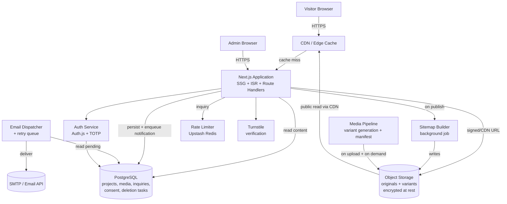
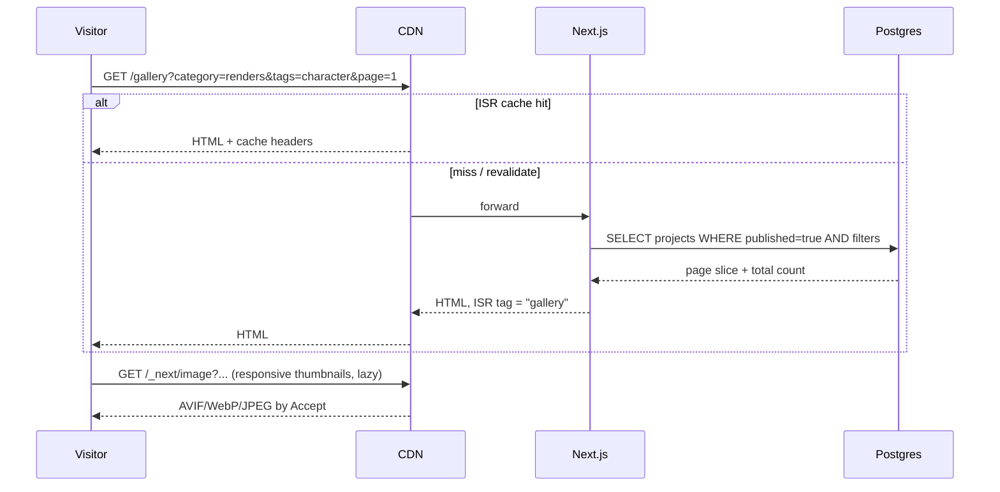
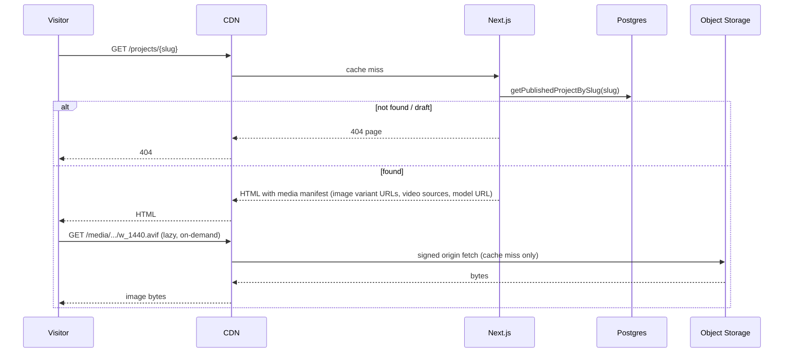
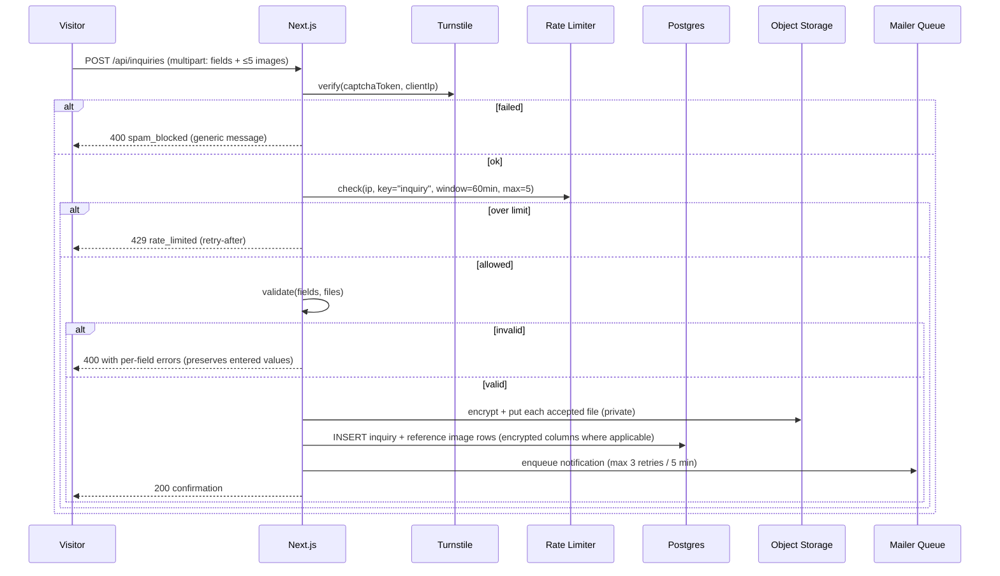
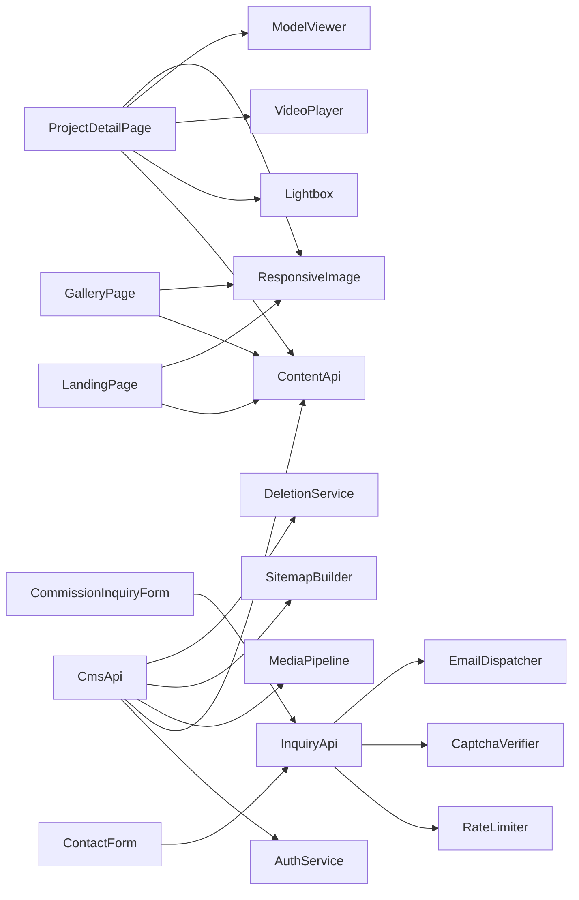

# Design Document: 3D Artist Portfolio

## Overview

The 3D Artist Portfolio is a content-driven public website for showcasing renders, models, and animations, paired with a private CMS for the Artist (Admin) to manage Projects, Media_Items, Bio content, and Inquiries. Visitors browse a featured landing page, a paginated/filterable Gallery, and rich Project_Detail_Pages that include image lightboxes, video playback, and an interactive 3D model viewer. Visitors can submit general contact messages and commission inquiries (with optional reference image attachments).

The design prioritizes:

- **Visual fidelity with fast delivery**: pre-rendered HTML, responsive image variants in AVIF/WebP/JPEG, lazy loading, and CDN caching keyed by content hash.
- **Accessibility**: WCAG 2.1 Level AA conformance, full keyboard support across the lightbox, video player, and 3D viewer, with focus traps and proper ARIA semantics.
- **Operational simplicity**: a single full-stack application (Next.js/App Router + TypeScript) covering both the public site and the CMS, with a relational database for content and inquiries and S3-compatible object storage for media.
- **Privacy and security by default**: HTTPS-only, encryption at rest for inquiries, consent-gated non-essential cookies, MFA-protected admin, CAPTCHA + per-IP rate limiting on public forms.
- **Property-based testability**: pure-logic seams (validation, filtering, sorting, pagination, content negotiation, sitemap generation, rate-limit accounting) are isolated from I/O so they can be exercised by property tests.

### Technology choices

| Concern | Choice | Rationale |
| --- | --- | --- |
| Web framework | Next.js 14 (App Router) + TypeScript | SSG with ISR for public pages, server actions for CMS, route handlers for public APIs |
| UI styling | Tailwind CSS + Radix Primitives | Accessible primitives for dialog/lightbox/menus; design-token discipline for contrast |
| Database | PostgreSQL via Prisma | Rich types for tags/categories, transactions for publish workflows |
| Object storage | S3-compatible (e.g., AWS S3, Cloudflare R2) with SSE-S3/SSE-KMS | Encrypted at rest; private originals, public variants behind CDN |
| Image pipeline | `sharp` for variant generation; built at upload + cached | AVIF/WebP/JPEG, three responsive widths minimum |
| Video pipeline | Pre-encoded MP4 (H.264) + WebM (VP9) progressive; native `<video>` | Sufficient for portfolio reels; avoids HLS infra complexity |
| 3D viewer | `<model-viewer>` (Web Component, glTF/GLB) | Battle-tested, accessible defaults, AR optional |
| Auth (CMS) | Auth.js with credentials + TOTP MFA, HTTP-only session cookies | Single Admin account, simple to audit |
| CAPTCHA | Cloudflare Turnstile (privacy-friendly) + honeypot | Both Contact and Commission forms |
| Rate limiting | Sliding-window counter in Upstash Redis (or in-memory in dev) | Per-IP, per-form keys |
| Email | Resend or Postmark | Transactional notifications + retry queue |
| Search/sitemap | Built at publish time via background job; cached blob | Simple, deterministic sitemap.xml |
| Hosting/CDN | Vercel or Cloudflare Pages + Functions | Edge caching + ISR; HTTPS/HSTS enforced |

The design treats framework details as implementation choices: the contracts and properties below remain valid against any equivalent stack.

## Architecture

### High-level system diagram



### Public vs admin surfaces

The application exposes two distinct route trees served by the same Next.js process:

- **Public site** (`/`, `/gallery`, `/projects/[slug]`, `/about`, `/contact`, `/commission`, `/privacy`, `/sitemap.xml`, `/robots.txt`): SSG/ISR; cached on CDN.
- **CMS** (`/admin/*`): server-rendered behind Auth.js middleware; never indexed; all routes denied in `robots.txt`.

A single middleware enforces:

1. HTTPS redirect (`http -> https`) and `Strict-Transport-Security` header.
2. `/admin/*` requires a valid Admin session; otherwise redirects to `/admin/login`.
3. Standard security headers (`Content-Security-Policy`, `Referrer-Policy: strict-origin-when-cross-origin`, `X-Content-Type-Options: nosniff`, `Permissions-Policy`).

### Key data flows

**Browsing the Gallery**



**Viewing a Project_Detail_Page**



**Submitting a Commission inquiry with attachments**



**Publishing a Project (CMS)**

```mermaid
sequenceDiagram
    participant A as Admin
    participant App as Next.js (CMS)
    participant DB as Postgres
    participant Sitemap as Sitemap Builder

    A->>App: POST /admin/projects/{id}/publish
    App->>App: requireAdminSession()
    App->>App: validatePublishable(project) // title, cover, ≥1 media
    alt invalid
        App-->>A: 422 with missing fields
    else valid
        App->>DB: UPDATE projects SET status='published'
        App->>App: revalidateTag('gallery'); revalidatePath('/projects/{slug}'); revalidatePath('/')
        App->>Sitemap: enqueue rebuild
        Sitemap->>DB: SELECT all published URLs
        Sitemap->>OS: write sitemap.xml (atomic)
        App-->>A: 200
    end
```

### Caching and revalidation

- Public pages use ISR with named tags (`gallery`, `landing`, `bio`, `project:{slug}`). On CMS writes that affect a tag, the server revalidates that tag.
- Image and video URLs embed a `contentHash` and are served `Cache-Control: public, max-age=31536000, immutable`.
- HTML uses short max-age + `stale-while-revalidate`.
- `sitemap.xml` is regenerated within 5 minutes of a publish/unpublish event by a debounced background job; on failure the previous valid file is retained and an error is surfaced in the CMS.

### Network policy

- TLS 1.2+ everywhere; HTTP requests to any URL are 301-redirected to HTTPS.
- HSTS: `max-age=31536000; includeSubDomains; preload` once verified.
- CSP: `default-src 'self'`; `img-src 'self' https://<cdn>`; `media-src 'self' https://<cdn>`; `script-src 'self' 'nonce-...' https://challenges.cloudflare.com`; `frame-src https://challenges.cloudflare.com`; no `unsafe-inline` for scripts.

## Components and Interfaces

### Public site components

#### LandingPage

**Purpose**: Render the Artist intro and featured Projects (Requirement 1).

```pascal
INTERFACE LandingPage
  PROCEDURE render(): HtmlResponse
END INTERFACE
```

**Responsibilities**:
- Reads `Bio.heroFields` (artist name, tagline) and the configured featured set, applying fallbacks per Requirement 1.6–1.8.
- Renders thumbnails using `ResponsiveImage`.
- Provides keyboard-focusable nav to Gallery, Bio, Contact.

#### GalleryPage

**Purpose**: Paginated, filterable, sortable Gallery (Requirement 2).

```pascal
INTERFACE GalleryPage
  PROCEDURE render(query: GalleryQuery): HtmlResponse
END INTERFACE

STRUCTURE GalleryQuery
  page: Integer DEFAULT 1
  category: CategoryId OR NULL
  tags: List<TagId>            // length 0..10
  sort: "newest" | "oldest" | "title_asc" DEFAULT "newest"
END STRUCTURE
```

**Responsibilities**:
- Composes a SQL filter from `category` (single) and `tags` (conjunctive, ALL must match).
- Resets page on filter changes (handled at link-build time).
- Returns 24 items per page; clamps `page` and emits a notice when out of range (Requirement 2.10).

#### ProjectDetailPage

**Purpose**: Render a single Project with media, navigation, and viewers (Requirement 3).

```pascal
INTERFACE ProjectDetailPage
  PROCEDURE render(slug: String): HtmlResponse
END INTERFACE
```

**Responsibilities**:
- 404 for missing or draft projects (Requirement 3.10).
- Renders title, description, category, tags, creation date, software used; uses placeholders for missing fields rather than omitting labels (Requirement 3.1).
- Iterates `mediaItems` in stored order; renders by `kind`:
  - `image` -> thumbnail in grid, click opens `Lightbox`.
  - `video` -> `VideoPlayer`.
  - `model3d` -> `ModelViewer`.
- Adds prev/next Project links, disabling at endpoints (Requirement 3.9).

#### Lightbox

**Purpose**: Full-screen image viewer with keyboard, focus trap, and 100% zoom toggle (Requirements 3.3–3.5, 10.6–10.7).

```pascal
INTERFACE Lightbox
  PROCEDURE open(items: List<MediaItem>, startIndex: Integer)
  PROCEDURE close()
  PROCEDURE next()
  PROCEDURE prev()
  PROCEDURE toggleActualSize()
END INTERFACE
```

**Responsibilities**:
- Implemented as a Radix Dialog with `aria-modal="true"`.
- Focus trap; restores focus to triggering thumbnail within 200 ms of close (Requirement 10.6).
- Disables Prev at index 0 and Next at index n-1 (Requirement 3.5).
- Prevents background scroll while open.
- Arrow keys navigate; Escape closes.

#### VideoPlayer

**Purpose**: Native HTML5 player with full controls (Requirement 3.6).

- Uses `<video controls preload="metadata">` with `<source>` for MP4 and WebM.
- Provides captions/transcript track when supplied (Requirement 10.8).
- Pauses on offscreen via IntersectionObserver to save bandwidth.

#### ModelViewer

**Purpose**: Interactive 3D model viewer (Requirement 3.7).

- Uses `<model-viewer>` web component with `camera-controls` (orbit), `interaction-prompt` for accessibility, programmatic min/max zoom.
- Lazy-loads the script only on Project_Detail_Pages that contain a `model3d` item (code split).
- Adds a keyboard-accessible "reset view" control; Escape returns focus to trigger.

#### BioPage

**Purpose**: Render Artist bio, skills, software, social links, and CV download (Requirement 5).

- Renders sections independently; one section's missing data does not block the others (Requirement 5.5).
- External profile links open in a new tab with `rel="noopener noreferrer"`.

#### ContactForm and CommissionInquiryForm

**Purpose**: Visitor-facing forms (Requirements 6, 7).

- Built with React Hook Form + Zod schemas (`contactSubmissionSchema`, `commissionInquirySchema`).
- Honeypot field hidden via CSS and `aria-hidden`.
- Turnstile widget below submit button.
- On submit, send `multipart/form-data` (commission only when attachments present) to `POST /api/inquiries`.
- Inline errors retain entered field values on rejection (Requirements 6.4, 7.5).

#### CookieConsentBanner

**Purpose**: Consent UI for non-essential cookies (Requirement 12.4–12.5).

- Renders only when `consentRecord` cookie is missing AND analytics/tracking is configured.
- Two explicit buttons: "Accept" and "Reject" (no "Continue browsing" loophole).
- Persists choice for 180 days; suppresses banner during that period.
- `accept` enables analytics module dynamic import; `reject` blocks it entirely.

#### Footer (and PrivacyPolicyPage)

- Footer contains a link to `/privacy` on every page.
- Privacy policy describes categories, purposes, retention, and contact (Requirement 12.1).

### Server components

#### ContentApi (read)

```pascal
INTERFACE ContentApi
  PROCEDURE listFeaturedProjects(): List<Project>
  PROCEDURE listGallery(query: GalleryQuery): GalleryPageResult
  PROCEDURE getProjectBySlug(slug: String): Project OR NULL
  PROCEDURE getBio(): Bio
  PROCEDURE listCategories(): List<Category>
  PROCEDURE listTags(): List<Tag>
END INTERFACE

STRUCTURE GalleryPageResult
  items: List<Project>            // length 0..24
  page: Integer                   // 1-based, clamped to [1, totalPages]
  totalPages: Integer             // ≥ 1 even when empty
  totalCount: Integer
  outOfRange: Boolean             // true iff requested page was clamped
END STRUCTURE
```

**Properties**:
- `getProjectBySlug` returns `NULL` when slug is unknown OR the project is in `draft` status (Requirement 8.7).
- Pure with respect to inputs given a fixed DB snapshot.

#### CmsApi (write, admin-only)

```pascal
INTERFACE CmsApi
  // Auth
  PROCEDURE login(username: String, password: String, totp: String): Session
  PROCEDURE logout()

  // Projects
  PROCEDURE createProject(input: ProjectInput): ProjectId
  PROCEDURE updateProject(id: ProjectId, input: Partial<ProjectInput>)
  PROCEDURE deleteProject(id: ProjectId)
  PROCEDURE setProjectStatus(id: ProjectId, status: "draft" | "published")

  // Media
  PROCEDURE uploadMedia(projectId: ProjectId, file: UploadedFile, kind: MediaKind, altText: String OR NULL): MediaItemId
  PROCEDURE reorderMedia(projectId: ProjectId, orderedIds: List<MediaItemId>)
  PROCEDURE deleteMedia(id: MediaItemId)

  // Bio
  PROCEDURE saveBio(input: BioInput)

  // Featured
  PROCEDURE setFeaturedProjects(orderedIds: List<ProjectId>)   // length 0..12

  // Inquiries
  PROCEDURE listInquiries(filter: InquiryFilter, page: Integer): InquiryPage
  PROCEDURE getInquiry(id: InquiryId): InquiryDetail
  PROCEDURE updateInquiryStatus(id: InquiryId, status: InquiryStatus)
  PROCEDURE deleteInquiry(id: InquiryId)
END INTERFACE
```

**Auth invariant**: every method except `login` requires a valid Admin session; otherwise the call returns `AUTH_REQUIRED` (Requirements 8.1, 9.8).

**Publish invariant**: `setProjectStatus(id, "published")` must call `validatePublishable(project)` first; on failure, status remains `draft` and a validation error is returned that lists every missing element individually (Requirement 8.11).

#### InquiryApi (public, write)

```pascal
INTERFACE InquiryApi
  PROCEDURE submitContact(submission: ContactSubmission, ctx: SubmissionContext): SubmissionResult
  PROCEDURE submitCommission(submission: CommissionInquiry, attachments: List<UploadedFile>, ctx: SubmissionContext): SubmissionResult
END INTERFACE

STRUCTURE SubmissionContext
  clientIp: String
  captchaToken: String
  honeypotValue: String OR NULL
  userAgent: String
END STRUCTURE

STRUCTURE SubmissionResult
  ok: Boolean
  status: 200 | 400 | 422 | 429
  errors: List<FieldError>           // empty when ok
  inquiryId: InquiryId OR NULL
END STRUCTURE
```

**Pipeline**:
1. CAPTCHA verification (Turnstile) and honeypot check; failure -> generic spam error (Requirement 6.6).
2. Rate-limit check (5 successful per 60-minute rolling window per IP, per form key) (Requirements 6.7, 7.8).
3. Schema validation (Zod): produces a `List<FieldError>` with stable codes; preserves entered values to the client (Requirements 6.4, 7.5, 7.7).
4. Attachment validation per file (commission only); per-file rejection with reason; valid files retained (Requirement 7.7).
5. Persist to DB (transactional); attachments uploaded with server-side encryption (Requirement 12.3).
6. Enqueue notification email job; return success.

#### MediaPipeline

**Purpose**: Generate and serve responsive variants for images, prepare video sources, and validate uploads (Requirements 4, 8.3–8.4).

```pascal
INTERFACE MediaPipeline
  PROCEDURE acceptUpload(file: UploadedFile, kind: MediaKind): MediaRef OR ValidationError
  PROCEDURE buildImageVariants(ref: MediaRef): List<ImageVariant>     // ≥ 3 widths covering mobile/tablet/desktop
  PROCEDURE chooseImageFormat(accept: String): "avif" | "webp" | "jpeg"
  PROCEDURE pickVariant(variants: List<ImageVariant>, viewportWidth: Integer): ImageVariant
  PROCEDURE prepareVideo(ref: MediaRef): VideoManifest                 // mp4 + webm sources, poster
  PROCEDURE prepareModel(ref: MediaRef): ModelManifest                 // glTF/GLB url
END INTERFACE

STRUCTURE ImageVariant
  url: String          // immutable, hash-keyed
  width: Integer
  format: "avif" | "webp" | "jpeg"
  bytes: Integer
END STRUCTURE
```

**Behavior**:
- `acceptUpload` enforces format whitelist (image: jpeg/png/webp; video: mp4/webm; model: gltf/glb) and a 100 MB ceiling per file. Rejection returns a stable `ValidationError`.
- `buildImageVariants` always emits at least one variant per band: `≤480`, `481..1024`, `≥1025`. It never upscales beyond the original width.
- `chooseImageFormat` parses `Accept` and picks AVIF if accepted, else WebP if accepted, else JPEG (Requirements 4.2, 4.3).
- `pickVariant` returns the smallest variant whose width is ≥ requested viewport width; if none, returns the largest available (Requirement 4.1).

#### ResponsiveImage (client/server component)

- Renders `<picture>` with `<source type="image/avif">`, `<source type="image/webp">`, fallback `` JPEG.
- `loading="lazy"`, `decoding="async"`, intrinsic `width`/`height` attributes for layout stability.
- Renders a low-quality placeholder (LQIP, ≤32 px longest dim) or a dominant color block within 500 ms of viewport entry (Requirement 4.6).
- On load failure or 15-second timeout, swaps placeholder for an inline error indicator + retry button; preserves layout; allows up to 3 retries per item (Requirement 4.7).

#### AuthService

- Auth.js with Credentials provider + TOTP MFA second step.
- Sessions are HTTP-only, `Secure`, `SameSite=Lax`, 8-hour idle timeout.
- Login endpoint is rate-limited (5 attempts / 15 min / IP).
- Successful login emits an audit log entry.

#### EmailDispatcher

- Async worker reads `notification_jobs` table.
- Each job has `attempt_count`, `next_run_at`, `last_error`.
- Retries up to 3 times within 5 minutes on transient failures (Requirements 6.8, 7.9). After exhaustion, marks the inquiry's `delivery_failed=true` and surfaces a banner to the Admin in the CMS Inquiries view.

#### RateLimiter

```pascal
INTERFACE RateLimiter
  PROCEDURE check(ip: String, key: String, windowSec: Integer, max: Integer, now: Timestamp): Decision
  PROCEDURE record(ip: String, key: String, now: Timestamp)
END INTERFACE

STRUCTURE Decision
  allowed: Boolean
  remaining: Integer
  retryAfterSec: Integer        // 0 when allowed
END STRUCTURE
```

- Sliding-window counter: stores per `(ip, key)` a deque of timestamps; any older than `windowSec` are evicted on access.
- `record` is only called after a successful submission, so failed validations do not count toward the limit but failed CAPTCHA still does (to slow attackers without penalising honest users with typos in the form fields beyond CAPTCHA).

#### SitemapBuilder

```pascal
INTERFACE SitemapBuilder
  PROCEDURE rebuild(): Result
END INTERFACE
```

- Triggered by publish/unpublish/delete events through a debounced job.
- Reads all published public URLs (landing, gallery base, project URLs, bio, contact, commission, privacy).
- Writes an atomic `sitemap.xml` to object storage and serves it from `/sitemap.xml` via a route handler.
- On failure, retains the previous valid file and writes an error to a CMS-visible error log (Requirements 11.6–11.7).

#### RobotsHandler

- Static response that allows all public URLs and disallows `/admin/`, `/api/`, and CMS-only paths (Requirement 11.5).

#### ConsentService

- Reads/writes a first-party `consent` cookie (180-day expiry).
- API: `getConsent(): "accepted" | "rejected" | "unset"`.
- All non-essential modules (analytics) are dynamically imported only after `getConsent() = "accepted"`.

#### DeletionService

- Implements Requirement 12.6–12.7. On Admin "delete inquiry" confirmation:
  1. Mark `inquiry.status = "pending_deletion"` and enqueue a `deletion_task`.
  2. Worker permanently removes the inquiry row, attachment objects in primary storage, and tombstones replicas/backups within 24 hours.
  3. Up to 3 automatic retries on failure; after exhaustion, leaves the inquiry in `pending_deletion` and notifies the Admin.

### Component dependency map



## Data Models

### Domain models

```pascal
STRUCTURE Project
  id: ProjectId                          // UUID
  slug: String                           // ^[a-z0-9](-?[a-z0-9])*$, ≤80 chars, globally unique
  title: String                          // 1..120
  description: String                    // 0..5000 (rendered as plain text or sanitized markdown)
  categoryId: CategoryId                 // exactly one
  tagIds: List<TagId>                    // 0..20
  coverMediaId: MediaItemId OR NULL
  mediaItems: List<MediaItem>            // ordered, 0..N at draft, ≥1 to publish
  softwareUsed: List<String>             // 0..20, each 1..60
  creationDate: Date                     // ≤ today
  publishedAt: Timestamp OR NULL         // set when status flips to "published"
  status: "draft" | "published"
  featuredOrder: Integer OR NULL         // 0..11 if featured, NULL otherwise
  createdAt: Timestamp
  updatedAt: Timestamp
END STRUCTURE

STRUCTURE MediaItem
  id: MediaItemId                        // UUID
  projectId: ProjectId
  ref: MediaRef
  kind: "image" | "video" | "model3d"
  altText: String OR NULL                // required at publish time for images per Req 10.4
  caption: String OR NULL                // 0..200
  ordering: Integer                      // 0-based, persisted on reorder
  captionsRef: MediaRef OR NULL          // VTT track for video (Req 10.8)
  transcript: String OR NULL             // for video accessibility
END STRUCTURE

STRUCTURE MediaRef
  storageKey: String                     // canonical key in object storage
  contentHash: String                    // SHA-256, used in URLs for immutability
  mimeType: String                       // image/jpeg | image/png | image/webp | video/mp4 | video/webm | model/gltf-binary | model/gltf+json
  width: Integer OR NULL
  height: Integer OR NULL
  durationSec: Number OR NULL
  byteSize: Integer
END STRUCTURE

STRUCTURE Category
  id: CategoryId                         // e.g. "renders", "models", "animations"; slugged
  name: String                           // 1..60
  ordering: Integer
END STRUCTURE

STRUCTURE Tag
  id: TagId
  label: String                          // 1..40
  ordering: Integer
END STRUCTURE

STRUCTURE Bio
  artistName: String                     // 1..100
  tagline: String                        // 1..160, no line breaks
  biography: String                      // 0..5000
  profileImage: MediaRef OR NULL
  skills: List<String>                   // 0..30, each 1..60 (≥1 required to render skills section)
  software: List<String>                 // 0..30, each 1..60
  socialLinks: List<SocialLink>          // 0..15
  resume: MediaRef OR NULL               // PDF up to 20 MB
  updatedAt: Timestamp
END STRUCTURE

STRUCTURE SocialLink
  platform: String                       // 1..40
  url: String                            // absolute https URL ≤2048
  ordering: Integer
END STRUCTURE
```

### Inquiry models

```pascal
STRUCTURE Inquiry
  id: InquiryId                          // UUID
  type: "contact" | "commission"
  submittedAt: Timestamp
  name: String                           // 1..100
  email: String                          // RFC 5322, 1..254
  subject: String OR NULL                // contact only, 1..200
  message: String                        // contact: 10..5000, commission: 20..5000
  status: "new" | "read" | "archived" | "pending_deletion"
  // commission-only fields:
  projectType: ProjectType OR NULL       // "Character" | "Environment" | "Product Visualization" | "Animation" | "Other"
  budgetRangeId: BudgetRangeId OR NULL
  targetDeadline: Date OR NULL           // ≥ submission date
  // operational:
  clientIp: String                       // truncated to /24 for IPv4 or /48 for IPv6 to minimize PII
  userAgent: String OR NULL
  encryptedAtRest: Boolean               // tracked for audit; underlying fields use column-level encryption or storage-level SSE
  notificationJobId: JobId OR NULL
  deliveryFailed: Boolean
  createdAt: Timestamp
  updatedAt: Timestamp
END STRUCTURE

STRUCTURE ReferenceImage
  id: ReferenceImageId
  inquiryId: InquiryId
  storageKey: String
  contentHash: String
  mimeType: "image/jpeg" | "image/png" | "image/webp"
  byteSize: Integer                      // ≤ 10 MB
  originalFilename: String
END STRUCTURE

STRUCTURE BudgetRangeOption
  id: BudgetRangeId
  label: String                          // 1..60
  ordering: Integer                      // 0..9, total options 1..10
END STRUCTURE
```

**Validation rules** (mirrored in Zod schemas; the same rules drive `validateContactSubmission`, `validateCommissionSubmission`, and `validatePublishable`):

- `email` matches a permissive RFC 5322 grammar and `length ≤ 254`.
- `Inquiry.targetDeadline ≥ Inquiry.submittedAt::date` for commission.
- `slug` matches `^[a-z0-9]+(-[a-z0-9]+)*$`, `length ∈ [1, 80]`, globally unique; rejecting collisions returns a stable error.
- `Project.featuredOrder` distinct across all projects within `[0, 11]`.
- Combined attachment size ≤ 50 MB; per-file ≤ 10 MB; format must be JPEG/PNG/WebP.

### Authentication and operational models

```pascal
STRUCTURE AdminUser
  id: AdminId
  username: String
  passwordHash: String                   // argon2id
  totpSecret: String                     // encrypted
  lastLoginAt: Timestamp OR NULL
  failedLoginCount: Integer
  lockedUntil: Timestamp OR NULL
END STRUCTURE

STRUCTURE Session
  id: SessionId                          // opaque, HTTP-only cookie value
  adminId: AdminId
  createdAt: Timestamp
  lastSeenAt: Timestamp
  expiresAt: Timestamp                   // idle timeout 8 h, hard cap 24 h
END STRUCTURE

STRUCTURE NotificationJob
  id: JobId
  inquiryId: InquiryId
  attemptCount: Integer                  // 0..3
  nextRunAt: Timestamp
  lastError: String OR NULL
  state: "pending" | "succeeded" | "failed"
END STRUCTURE

STRUCTURE DeletionTask
  id: DeletionTaskId
  inquiryId: InquiryId
  attemptCount: Integer                  // 0..3
  nextRunAt: Timestamp
  state: "pending" | "succeeded" | "failed"
END STRUCTURE

STRUCTURE ConsentRecord
  // Stored as a first-party cookie keyed by browser; not in DB.
  decision: "accepted" | "rejected"
  decidedAt: Timestamp
  expiresAt: Timestamp                   // decidedAt + 180 days
END STRUCTURE

STRUCTURE AuditEvent
  id: AuditId
  actorId: AdminId
  action: String                         // e.g. "project.publish", "inquiry.delete"
  targetId: String OR NULL
  occurredAt: Timestamp
  metadata: JSON
END STRUCTURE
```

### Database schema notes (Postgres / Prisma)

- `projects (status)`, `projects (published_at DESC)`, and `project_tags (tag_id)` are indexed for Gallery filters/sort.
- `inquiries (submitted_at DESC, status)` index for the Inquiries view sort and filter.
- `unique(slug)` on `projects`; `unique(email_lower)` is **not** added (visitors may submit multiple times intentionally).
- Inquiry text columns (`name`, `email`, `subject`, `message`, attachment metadata) use column-level encryption (e.g., pgcrypto with KMS-managed key) so backups remain unreadable without the key (Requirement 12.3). Attachments in object storage use SSE-KMS with the same key alias.
- Soft-delete is **not** used for inquiries (Requirement 12.6 mandates permanent removal); a `pending_deletion` interim state is the only intermediate.

### Request/response DTOs (selected)

```pascal
STRUCTURE ContactSubmission
  name: String
  email: String
  subject: String
  message: String
END STRUCTURE

STRUCTURE CommissionInquiry
  name: String
  email: String
  projectType: ProjectType
  budgetRangeId: BudgetRangeId
  targetDeadline: Date
  description: String
END STRUCTURE

STRUCTURE FieldError
  field: String                          // e.g. "email", "attachments[2]"
  code: String                           // e.g. "email_invalid", "file_too_large"
  message: String                        // human-readable; localized on client
END STRUCTURE
```

### Public URL surface

- `GET /` — landing.
- `GET /gallery` — gallery (query: `category`, `tags[]`, `sort`, `page`).
- `GET /projects/{slug}` — project detail.
- `GET /about` — bio.
- `GET /contact` — contact form.
- `GET /commission` — commission form.
- `GET /privacy` — privacy policy.
- `GET /sitemap.xml`, `GET /robots.txt`.
- `POST /api/inquiries` — both forms; `type` field discriminates.
- `GET /api/og/{page}` — Open Graph image fallback (used when no per-project OG image is set).

### CMS URL surface (admin-only)

- `GET /admin` — dashboard.
- `GET|POST /admin/login` — login + TOTP step.
- `GET /admin/projects`, `GET|POST /admin/projects/[id]`, `POST /admin/projects/[id]/publish`, `POST /admin/projects/[id]/unpublish`.
- `POST /admin/projects/[id]/media` — upload; `POST /admin/projects/[id]/media/reorder`; `DELETE /admin/media/[id]`.
- `GET|POST /admin/bio`.
- `GET|POST /admin/featured`.
- `GET /admin/inquiries`, `GET /admin/inquiries/[id]`, `POST /admin/inquiries/[id]/status`, `DELETE /admin/inquiries/[id]`.

All `/admin/*` routes require an authenticated session; otherwise the middleware returns `401` for API-style routes and redirects to `/admin/login` for HTML routes (Requirements 8.1, 9.8).

## Correctness Properties

*A property is a characteristic or behavior that should hold true across all valid executions of a system — essentially, a formal statement about what the system should do. Properties serve as the bridge between human-readable specifications and machine-verifiable correctness guarantees.*

The properties below come directly from the prework analysis. Redundant per-criterion properties have been consolidated. Each property is universally quantified, refers to functions named in the Components section, and links back to the requirements it validates. Property-based tests will assert each one against generated inputs (≥100 iterations per test) using `fast-check`.

### Property 1: Bio header validation totality

*For any* string `name` and any string `tagline`, `validateBioHeader(name, tagline)` succeeds iff `1 ≤ len(name) ≤ 100` AND `1 ≤ len(tagline) ≤ 160` AND `tagline` contains no `\n` or `\r`. Otherwise it returns a non-empty list of stable error codes that names every violated rule.

**Validates: Requirements 1.2**

### Property 2: Landing featured selection

*For any* list `projects` and admin-configured featured set `F` of size `0..12`, `selectLandingFeatured(projects, F)` satisfies:

- If `|F| ≥ 1`, the result is `F` filtered to published projects, in admin order, and `3 ≤ |result| ≤ 8` whenever the configured size lies in that band; sizes outside that band are clamped (`|result| = max(0, min(|F|, 8))`).
- If `|F| = 0` and `published(projects)` is non-empty, the result is the `min(|published|, 6)` most recently published projects in `publishedAt`-descending order.
- If `|F| = 0` and `published(projects)` is empty, the result is empty (UI renders the placeholder).

Every entry in the result has a non-NULL cover image reference (so a thumbnail can be derived) and a navigable href of the form `/projects/{slug}`.

**Validates: Requirements 1.3, 1.6, 1.7, 1.8**

### Property 3: Gallery filter, sort, and pagination

*For any* `projects` list, `query: GalleryQuery`, and `pageSize = 24`, `listGallery(projects, query)` returns `result` such that:

- Every item in `result.items` has `status = "published"` AND (when `query.category ≠ NULL`) `item.categoryId = query.category` AND (`query.tags ⊆ item.tagIds`).
- Sort order:
  - `query.sort = "newest"` ⇒ `item[i].publishedAt ≥ item[i+1].publishedAt`,
  - `query.sort = "oldest"` ⇒ `item[i].publishedAt ≤ item[i+1].publishedAt`,
  - `query.sort = "title_asc"` ⇒ `item[i].title ≤ item[i+1].title` under standard locale collation.
- `|result.items| ≤ 24` and `result.totalPages = max(1, ceil(totalMatching / 24))` and `1 ≤ result.page ≤ result.totalPages`.
- `result.outOfRange = true` iff `query.page < 1` or `query.page > result.totalPages`; in that case `result.page = 1`.
- The result is invariant under any zero-impact reordering of `query.tags` (set semantics, not list).

**Validates: Requirements 2.1, 2.3, 2.4, 2.5, 2.6, 2.8, 2.9, 2.10, 8.7**

### Property 4: Project tile DTO completeness

*For any* published `project`, `buildTile(project)` produces a tile DTO with:

- `title` truncated to ≤ 80 characters,
- `categoryName` resolved from `categoryId`,
- `coverImage` set to a non-NULL `ResponsiveImage` (using `project.coverMediaId` when present, otherwise the placeholder image),
- `href = /projects/{project.slug}` matching the slug regex.

**Validates: Requirements 2.2, 2.7**

### Property 5: Project detail field rendering completeness

*For any* `project`, `buildDetailDTO(project)` includes labels and slots for `title`, `description`, `categoryName`, `tags`, `creationDate`, and `softwareUsed` regardless of which fields are NULL or empty; missing values render the placeholder marker rather than being omitted. The DTO's `mediaItems` array preserves `project.mediaItems` ordering exactly. When `project.mediaItems` is empty, `noMediaMessage = true`.

**Validates: Requirements 3.1, 3.2**

### Property 6: Lightbox navigation and viewer keyboard behaviour

*For any* media list of length `n ≥ 1` and any current index `i ∈ [0, n-1]`, the `Lightbox` reducer satisfies:

- `prev` is disabled iff `i = 0`; `next` is disabled iff `i = n - 1`.
- After `prev`, the index is `max(0, i - 1)`; after `next`, the index is `min(n - 1, i + 1)`.
- `toggleActualSize` is involutive: applying it twice returns to the original mode.
- Pressing `Escape` transitions the lightbox/3D-viewer state to `closed` and emits a `restoreFocus` event whose target equals the original trigger.
- While open, `Tab`/`Shift+Tab` cycles only through controls registered with the focus trap (Tab from last → first; Shift+Tab from first → last).

**Validates: Requirements 3.4, 3.5, 10.6, 10.7**

### Property 7: Adjacent project navigation

*For any* list of published `projects` ordered by `publishedAt` descending, and any current `slug`, `getAdjacentProjects(projects, slug)`:

- Returns `prev = projects[i - 1]` if `i > 0`, else `prev = NULL`.
- Returns `next = projects[i + 1]` if `i + 1 < |projects|`, else `next = NULL`.
- The "previous Project" control is disabled iff `prev = NULL`; the "next Project" control is disabled iff `next = NULL`.

**Validates: Requirements 3.9**

### Property 8: Project visibility safety

*For any* `projects` list and any `slug`, every public read function (`getProjectBySlug`, `listGallery`, `selectLandingFeatured`, `buildSitemap`) returns NULL/excludes any project whose `status ≠ "published"`. After `deleteProject(p.id)`, `getProjectBySlug(p.slug)` returns NULL and `getMediaById(m.id)` returns NULL for every `m ∈ p.mediaItems`. The HTTP 404 response is identical for missing and unpublished slugs (no oracle on existence).

**Validates: Requirements 3.10, 8.7, 8.8**

### Property 9: Image content negotiation and variant selection

*For any* `Accept` header `h` and any candidate variant set `V` covering at least mobile (`≤480`), tablet (`481..1024`), and desktop (`≥1025`):

- `chooseImageFormat(h)` returns `"avif"` if `h` advertises `image/avif`, otherwise `"webp"` if `h` advertises `image/webp`, otherwise the original raster format.
- For any viewport width `w ≥ 1`, `pickVariant(V, w)` returns the smallest variant whose `width ≥ w`; if no such variant exists, it returns the largest available variant.
- For any image with intrinsic width `W`, `buildImageVariants(ref)` never produces a variant whose `width > W` (no upscaling).

**Validates: Requirements 4.1, 4.2, 4.3**

### Property 10: Lazy-load and placeholder state machine

*For any* finite sequence of events `[enterViewport, loadStart, loadEnd | loadError, retry, ...]`:

- A `loadStart` is dispatched iff the element's distance to the viewport is `≤ 200 px`; once dispatched, no second `loadStart` occurs for the same attempt.
- The placeholder is visible iff the full image has not yet reached the `loaded` state.
- `retryCount ≤ 3` at all times; the state never leaves `{idle, loading, loaded, error}`; intrinsic `width`/`height` attributes are constant across all transitions (no layout shift).
- A `timeout` is raised iff `loadEnd` and `loadError` have not arrived within 15 s of `loadStart`.

**Validates: Requirements 4.4, 4.6, 4.7**

### Property 11: Inquiry submission validation atomicity

*For any* submission `s` against schema `S` (contact or commission), `validate(s, S)` is pure and returns:

- An empty error list iff every per-field rule in the data model holds (length bounds, RFC 5322 email, deadline ≥ submission date for commission, project type ∈ enum, budget id ∈ admin-configured set, description bounds).
- Otherwise a non-empty list of `FieldError` objects (one per violated rule, no duplicates) using stable codes.

When `submitContact`/`submitCommission` is invoked with a submission that fails validation, no DB row is written, no notification job is enqueued, no rate-limit record is incremented, and the response preserves all entered field values.

**Validates: Requirements 6.1, 6.4, 7.1, 7.2, 7.5**

### Property 12: Spam and rate-limit gating

*For any* IP address `ip`, form `key ∈ {"contact", "commission"}`, and any sequence of submissions `[s1, s2, ...]` with timestamps `[t1, t2, ...]`:

- A submission is rejected with the spam error code iff CAPTCHA verification fails OR the honeypot field is non-empty OR the provider-flagged spam predicate holds; rejected spam submissions never persist data and never enqueue notifications.
- Across the sequence, the count of submissions accepted past the rate-limit gate within any 60-minute rolling window for the same `(ip, key)` is at most 5; the 6th and beyond return `status = 429` with a `retry-after` value `≤ 3600 s`.

**Validates: Requirements 6.5, 6.6, 6.7, 7.8**

### Property 13: Attachment validation with partial rejection

*For any* list of uploaded files `files` for a commission submission, `validateAttachments(files)` produces `(accepted, rejected)` such that:

- `|files| = |accepted| + |rejected|`,
- For every `f ∈ accepted`: `f.byteSize ≤ 10 MB` AND `f.mimeType ∈ {image/jpeg, image/png, image/webp}` AND `sum(f.byteSize for f in accepted) ≤ 50 MB` AND `|accepted| ≤ 5`,
- For every `f ∈ rejected`: at least one constraint above is violated, and the rejection record carries the `originalFilename` and a stable reason code,
- The function never modifies `accepted` files and never causes valid files to be rejected because of unrelated invalid files (other than the global per-submission size/count caps).

**Validates: Requirements 7.6, 7.7**

### Property 14: Notification delivery state machine

*For any* notification job and any sequence of provider responses `[r1, r2, ...]`:

- `attemptCount ≤ 3` and total elapsed retry time `≤ 5 min` from the first attempt.
- `state = "succeeded"` iff at least one `ri = ok`; `state = "failed"` iff all 3 attempts returned non-ok.
- `inquiry.deliveryFailed = true` iff the job's terminal state is `"failed"`.
- The visitor's confirmation message is rendered exactly once per successful persistence and is never retracted by subsequent notification failures.

**Validates: Requirements 6.8, 7.9**

### Property 15: Admin authorization invariant

*For any* CMS API call `c` (other than `login`) and any session `s`, `c` returns `AUTH_REQUIRED` and produces no side effects iff `s` is missing or invalid (expired, tampered, or for a non-existent admin). When `s` is valid, `c` proceeds normally.

**Validates: Requirements 8.1, 9.8**

### Property 16: Project input and publish-readiness validation

*For any* `ProjectInput` `p`, `validateProjectInput(p)` succeeds iff: `1 ≤ len(title) ≤ 120`, `0 ≤ len(description) ≤ 5000`, exactly one category, `0 ≤ |tags| ≤ 20`, `0 ≤ |software| ≤ 20` (each `1..60`), `creationDate ≤ today`, and `status ∈ {"draft", "published"}`.

For any persisted project `p`, `validatePublishable(p)` returns the exact set of violations among `{missing_title, missing_cover_media, no_media_items, missing_alt_text(mediaId)}`. When the set is non-empty, `setProjectStatus(p.id, "published")` leaves `p.status = "draft"` and surfaces every violation; otherwise the status flips to `"published"`.

**Validates: Requirements 8.2, 8.11, 10.3, 10.4**

### Property 17: Media upload validation

*For any* uploaded file `f` and declared `kind`, `acceptUpload(f, kind)` succeeds iff:

- `kind = "image"` and `mimeType ∈ {image/jpeg, image/png, image/webp}`, or
- `kind = "video"` and `mimeType ∈ {video/mp4, video/webm}`, or
- `kind = "model3d"` and `mimeType ∈ {model/gltf+json, model/gltf-binary}`,

AND `byteSize ≤ 100 MB`. Otherwise it returns a stable `ValidationError` and never attaches the file to a project.

**Validates: Requirements 8.3, 8.4**

### Property 18: Media reorder preserves contents

*For any* project `p` with media `M = [m1, ..., mn]` and any permutation `P` of `[m1.id, ..., mn.id]`, after `reorderMedia(p.id, P)`:

- `getProject(p.id).mediaItems` ordering equals `P` (sorted ascending by `ordering`),
- `multiset(getProject(p.id).mediaItems) = multiset(M)` (no item added, removed, or duplicated).

**Validates: Requirements 8.5**

### Property 19: Featured set bounds and uniqueness

*For any* list of project ids `ids`, `setFeaturedProjects(ids)` succeeds iff `0 ≤ |ids| ≤ 12` AND all ids are distinct AND every id refers to a published project. After success, `listFeaturedProjects()` returns ids in the supplied order.

**Validates: Requirements 8.10**

### Property 20: Inquiry listing — ordering, paging, filtering, DTO completeness

*For any* list of inquiries `I`, any `filter`, and any `page ≥ 1`, `listInquiries(I, filter, page)` returns `result` such that:

- Every `i ∈ result.items` matches `filter` (type and status filters are conjunctive).
- The order of `result.items` is non-increasing on `submittedAt`.
- `|result.items| ≤ 25` and `result.totalPages = max(1, ceil(|matching| / 25))` and `1 ≤ result.page ≤ result.totalPages`.
- For each item, the DTO contains `submittedAt`, `name` truncated to ≤100, `email` truncated to ≤254, `type ∈ {general, commission}`, and `status ∈ {new, read, archived}`.
- `|result.items| = 0` iff no inquiry matches; `result.emptyState = true` in that case.

**Validates: Requirements 9.1, 9.2, 9.7**

### Property 21: Inquiry status transition safety

*For any* inquiry `i` and target status `s ∈ {new, read, archived}`, when persistence succeeds `getInquiry(i.id).status = s` and every other field is unchanged. When persistence fails, the persisted status equals the prior status, no other fields change, and the response carries an error code.

**Validates: Requirements 9.5, 9.6**

### Property 22: Inquiry detail completeness

*For any* commission inquiry `i` with `k` reference images, `getInquiryDetail(i.id)` returns a DTO containing all submitted fields, exactly `k` thumbnail entries each with a full-size link and the corresponding `originalFilename`, and `noAttachments = (k = 0)`. For contact inquiries, `noAttachments = true`.

**Validates: Requirements 9.3, 9.4**

### Property 23: Color contrast against design tokens

*For any* pair of design tokens `(fg, bg)` selected for body text rendering, `contrastRatio(fg, bg) ≥ 4.5`. For any pair selected for large-text contexts (≥18 pt or ≥14 pt bold), `contrastRatio(fg, bg) ≥ 3`. For focus indicators, `contrastRatio(focusRing, adjacentBg) ≥ 3`.

**Validates: Requirements 10.2, 10.5**

### Property 24: Page meta resolver

*For any* set of pages `P` covering landing, gallery, bio, and every published Project_Detail_Page, `resolveMeta(p)` returns a record where:

- `10 ≤ len(title) ≤ 60`, `50 ≤ len(description) ≤ 160`,
- `og:title = twitter:title` and `og:description = twitter:description`, both within the same length bounds,
- `og:image = twitter:image` references an asset with intrinsic dimensions `≥ 1200 × 630` and byte size `≤ 5 MB`,
- For any two distinct pages `p1, p2 ∈ P`: `resolveMeta(p1).title ≠ resolveMeta(p2).title` AND `resolveMeta(p1).description ≠ resolveMeta(p2).description`.

**Validates: Requirements 11.1, 11.2, 11.3**

### Property 25: Sitemap and robots correctness

*For any* `projects` list and the static public-page set, `buildSitemap(projects)` produces a URL set `U` such that:

- `u ∈ U` iff `u` is a public page or a Project_Detail_Page for a project with `status = "published"`,
- No `u ∈ U` matches the CMS pattern `/admin/*` or any internal API route,
- The total count satisfies `|U| = staticPublicPages + count(published(projects))`.

For the robots policy, `isAllowedByRobots(u)` is true iff `u` matches a public page pattern listed in the sitemap; CMS and API routes are disallowed.

**Validates: Requirements 11.4, 11.5**

### Property 26: Sitemap rebuild workflow

*For any* sequence of publish/unpublish/delete events, after each event a rebuild job is enqueued, and on successful rebuild the persisted sitemap blob equals `buildSitemap(currentProjects)`. On rebuild failure, the previously stored blob is unchanged and an admin error flag is set.

**Validates: Requirements 11.6, 11.7**

### Property 27: HTTPS-only redirect

*For any* inbound request URL `u` whose scheme is `http`, the middleware response is a `301` to the same `host`, `path`, and `query` with scheme replaced by `https`.

**Validates: Requirements 12.2**

### Property 28: Consent-gated cookies

*For any* visitor session and any cookie `c`, the server sets `c` only if either `c` is essential OR `getConsent() = "accepted"`. Once `getConsent() = "rejected"`, no non-essential cookie is set for the lifetime of that decision (`expiresAt = decidedAt + 180 days`), and the consent banner is hidden until `now ≥ expiresAt` or the consent record is cleared.

**Validates: Requirements 12.4, 12.5**

### Property 29: Inquiry deletion state machine

*For any* inquiry `i` confirmed for deletion and any sequence of provider responses for the deletion task `[r1, r2, ...]`:

- `attemptCount ≤ 3` at all times,
- The task's terminal state is `"succeeded"` iff some `ri = ok` within the 24-hour deadline; otherwise the terminal state is `"failed-manual"` and the inquiry remains in `pending_deletion` until manual intervention,
- On `"succeeded"`: the inquiry row, every `ReferenceImage` row, and every corresponding object in primary and replica storage are absent,
- The state never regresses (no transition `succeeded → pending_deletion`).

**Validates: Requirements 12.6, 12.7**

## Error Handling

### Error Scenario 1: Visitor requests a missing or unpublished Project

- **Detection**: `getProjectBySlug(slug)` returns NULL.
- **Response**: HTTP `404` with the standard "Project not found" page including a "Back to Gallery" control. The 404 response is byte-identical for "no such slug" and "slug exists but draft" so the existence of unpublished projects is not leaked.
- **Recovery**: No state change; `revalidateTag('project:{slug}')` is a no-op.

### Error Scenario 2: Visitor requests an out-of-range Gallery page

- **Detection**: `query.page < 1` or `query.page > totalPages`.
- **Response**: Render page 1 with a banner: "The page you requested is not available; showing the first page instead."
- **Recovery**: None; `outOfRange` flag is reset on subsequent navigations.

### Error Scenario 3: Media variant generation fails

- **Detection**: `buildImageVariants` throws or `prepareVideo` cannot read source.
- **Response**: For images, fall back to the next preferred format, then to the original raster, then to a transparent placeholder; never block page rendering. For video, the player surfaces an inline error overlay with a retry control. For models, the viewer falls back to a static cover image with an error banner.
- **Recovery**: Errors are logged with `storageKey`/`contentHash`; subsequent successful builds populate the CDN cache.

### Error Scenario 4: Media item fails to load in browser

- **Detection**: ``/`<video>` `error` event or 15-s timeout.
- **Response**: Replace placeholder with an inline error indicator and "Retry" button; preserve intrinsic `width`/`height` to prevent CLS.
- **Recovery**: Up to 3 manual retries per item; on success, normal load completes.

### Error Scenario 5: Visitor submits invalid Contact or Commission form

- **Detection**: Zod schema returns issues, attachment validator returns rejections, or deadline precedes submission date.
- **Response**: HTTP `400` with `{ errors: FieldError[] }`. The client preserves all entered values, focuses the first invalid field, and lists every per-field error.
- **Recovery**: User edits and resubmits; rate limit is not consumed by validation failures.

### Error Scenario 6: Visitor submission flagged as spam

- **Detection**: Turnstile verification fails, honeypot field is non-empty, or the provider returns a spam score above threshold.
- **Response**: HTTP `400` with a single generic error code `spam_blocked`; do not reveal which check failed.
- **Recovery**: User may retry; rate limiter still tracks failed CAPTCHA attempts to slow attackers.

### Error Scenario 7: Visitor exceeds rate limit

- **Detection**: Sliding-window counter exceeds 5 successful submissions in 60 min for the `(ip, key)` pair.
- **Response**: HTTP `429` with `Retry-After` header and a user-friendly message stating when to try again.
- **Recovery**: Counter decays naturally; no manual intervention needed.

### Error Scenario 8: Notification email delivery fails

- **Detection**: Email provider returns non-2xx.
- **Response**: Inquiry remains persisted; visitor confirmation has already been displayed and is not retracted. The job is retried up to 3 times within 5 minutes.
- **Recovery**: After 3 failures, `inquiry.deliveryFailed = true`; the CMS Inquiries view shows an alert banner so the Admin can copy the message manually.

### Error Scenario 9: CMS upload exceeds size or unsupported format

- **Detection**: `acceptUpload` rejects.
- **Response**: HTTP `400` with `{ code: "unsupported_format" | "file_too_large" }` and the original filename echoed back; nothing is attached to the project.
- **Recovery**: Admin re-exports at supported format/size.

### Error Scenario 10: Admin attempts to publish an incomplete Project

- **Detection**: `validatePublishable` returns a non-empty violation set.
- **Response**: HTTP `422` with the full violation list (`missing_title`, `missing_cover_media`, `no_media_items`, `missing_alt_text(mediaId)` per offending media). Project remains `draft`.
- **Recovery**: Admin fixes each violation; re-submits.

### Error Scenario 11: Inquiry status update fails to persist

- **Detection**: DB transaction failure on `updateInquiryStatus`.
- **Response**: HTTP `5xx` with a stable code; in-memory list left as-is in the UI; banner shown to the Admin.
- **Recovery**: Admin retries; no partial update is visible.

### Error Scenario 12: Inquiry deletion job fails

- **Detection**: Storage-layer or DB error in the deletion worker.
- **Response**: Inquiry stays in `pending_deletion`; up to 3 automatic retries with exponential backoff; on terminal failure, surface an error in the CMS for manual intervention.
- **Recovery**: Admin can re-trigger deletion or escalate to operations.

### Error Scenario 13: Sitemap rebuild fails

- **Detection**: Builder error or storage write failure.
- **Response**: Retain the previous valid `sitemap.xml`; surface an error indicator in the CMS dashboard.
- **Recovery**: Builder is re-run on the next publish/unpublish event, or manually from the CMS.

### Error Scenario 14: CMS write attempted without authentication

- **Detection**: Middleware finds no valid session.
- **Response**: API routes return `401 unauthorized`; HTML routes redirect to `/admin/login`. No side effects occur.
- **Recovery**: Admin signs in (with TOTP MFA) and retries.

### Error Scenario 15: HTTP request received

- **Detection**: Edge-level scheme check.
- **Response**: `301` redirect to the `https` equivalent preserving path/query; `Strict-Transport-Security` header on subsequent responses.
- **Recovery**: None.

## Testing Strategy

### Suitability of property-based testing

PBT is appropriate for this feature because the system is dominated by pure-logic seams that benefit from randomized input coverage:

- Form validation (contact, commission, attachments, project input, publishable, bio).
- Gallery filter/sort/pagination logic.
- Variant selection and content negotiation.
- Lightbox/3D viewer reducer and focus trap.
- Rate-limit sliding window.
- Sitemap and meta-tag derivation.
- Notification and deletion state machines.

PBT is **not** appropriate for the parts described below; those will be exercised through other techniques.

| Concern | Why not PBT | Approach |
| --- | --- | --- |
| CSS layout, visual fidelity | Output is pixels, not a function with a meaningful universal property | Visual regression at viewports 320, 375, 768, 1024, 1280, 1920, 2560 |
| Browser native players (`<video>`, `<model-viewer>`) | Third-party black box | Smoke + interaction tests, captions toggle assertion |
| External email provider | Already tested by vendor; cost prohibitive | Mocked unit tests + 1–2 sandbox integration tests |
| HTTPS/HSTS configuration | One-shot configuration | Smoke test against deployed environment |
| Admin SSO/MFA flow | One-shot; vendor-tested | Example-based e2e |
| Performance budgets (LCP, navigation under N seconds) | Not a function of input variation | Lighthouse CI with thresholds |

### Test layers

#### Unit tests (Vitest)

- Pure helpers: `validateContactSubmission`, `validateCommissionSubmission`, `validateAttachments`, `validateProjectInput`, `validatePublishable`, `pickVariant`, `chooseImageFormat`, `comparators` for gallery sorts, slug regex, email regex, rate-limit counter, sliding-window eviction, sitemap builder, robots matcher, OG image picker.
- Coverage goal: ≥ 90% line coverage on `lib/**`.
- Boundary inputs are written explicitly even when also covered by PBT.

#### Property-based tests (fast-check)

- One test per property in the Correctness Properties section.
- Each test runs **at least 100 iterations** (via `fc.assert(prop, { numRuns: 100 })`).
- Each test is annotated:
  ```ts
  // Feature: 3d-artist-portfolio, Property 3: Gallery filter, sort, and pagination
  ```
- Generators are defined once per domain type (`projectArbitrary`, `galleryQueryArbitrary`, `acceptHeaderArbitrary`, `inquiryArbitrary`, etc.) and shared across tests.
- Generators include explicit edge-case shrinking targets: empty lists, single-item lists, max-length strings, Unicode names, RFC 5322 corner emails, exact-boundary file sizes, and tag sets at length 1 and 10.
- Properties involving time (rate limit, retries, deletion deadline) use a deterministic `Clock` interface so timestamps are arbitrary inputs.

#### Component tests (Playwright Component Tests / React Testing Library)

- Render `Lightbox`, `VideoPlayer`, `ModelViewer`, `ResponsiveImage`, `ContactForm`, `CommissionInquiryForm`, `CookieConsentBanner`, footer privacy link.
- Verify keyboard interactions (Escape, Tab, Shift+Tab, arrow keys), focus trap, focus restoration timing.
- Verify form-error rendering preserves entered values across resubmits.

#### Accessibility tests

- `axe-core` run on every page template (landing, gallery, project detail, bio, contact, commission, privacy, CMS pages).
- Color-contrast property tests over the design-token table (Property 23).
- Manual checks documented in the QA checklist for screen readers (NVDA + VoiceOver) on the lightbox and model viewer.

#### End-to-end tests (Playwright)

- Visitor flows: open landing → click featured → view detail → open lightbox → submit contact (valid and invalid) → submit commission with attachments → cookie consent accept/reject path.
- Admin flows: log in (with TOTP) → create project → upload media → publish → see on landing → submit a test inquiry → mark read → delete inquiry → verify removal.
- Negative auth: `/admin/*` without session redirects; CMS API without session returns 401.

#### Integration tests

- DB integration with a disposable Postgres (Testcontainers) for repository methods, rate-limit and notification jobs, deletion task workflow.
- Object storage integration with a local MinIO container for upload/encryption/listing.
- Email delivery against a sandbox provider (Postmark/Resend test mode) for end-to-end notification verification, including retry on simulated 5xx.
- Sitemap rebuild flow on simulated publish/unpublish/delete events.

#### Smoke tests (post-deploy)

- HTTPS/HSTS headers present on production responses.
- `robots.txt` and `sitemap.xml` reachable and well-formed.
- CMS not indexable (admin route returns `noindex`).
- Encryption-at-rest configuration verified by inspecting bucket policy and DB column encryption.

### Property test configuration template

```ts
import fc from 'fast-check';

// Feature: 3d-artist-portfolio, Property 9: Image content negotiation and variant selection
test('chooseImageFormat respects Accept header preference', () => {
  fc.assert(
    fc.property(acceptHeaderArbitrary, (header) => {
      const fmt = chooseImageFormat(header.value);
      if (header.acceptsAvif) return fmt === 'avif';
      if (header.acceptsWebp) return fmt === 'webp';
      return fmt === header.originalFormat;
    }),
    { numRuns: 100 },
  );
});
```

### Coverage and CI gates

- Unit + property tests run on every PR; failure blocks merge.
- Counterexamples produced by `fast-check` are saved as regression seeds (`fc.assert(prop, { seed: ... })`) so once-failed inputs are replayed in CI.
- Lighthouse and axe results are uploaded as PR artifacts; regressions beyond the configured thresholds fail the build.
- E2E suite runs on staging post-deploy; smoke tests run on production after every deploy.

## Dependencies

- **Web framework / runtime**: Next.js 14 + React 18 + TypeScript 5.
- **UI**: Tailwind CSS, Radix Primitives, `@google/model-viewer`.
- **Validation**: Zod.
- **Database / ORM**: PostgreSQL 16, Prisma.
- **Object storage**: S3-compatible (AWS S3 or Cloudflare R2) with SSE-KMS.
- **Image processing**: `sharp` (build/upload-time variant generation).
- **Auth**: Auth.js (NextAuth) with Credentials + TOTP via `otplib`; argon2 for password hashing.
- **CAPTCHA**: Cloudflare Turnstile.
- **Rate limiting / cache**: Upstash Redis (or compatible).
- **Email**: Resend or Postmark.
- **Hosting / CDN**: Vercel or Cloudflare Pages + Workers.
- **Tests**: Vitest, fast-check, Playwright, axe-core, Lighthouse CI, Testcontainers, MinIO.

## Open Decisions and Rationale

- **Single full-stack app vs separate CMS**: chosen single-app for operational simplicity and to share Zod schemas between client validation and server validation. A dedicated headless CMS (Sanity, Contentful) is a viable alternative if multi-author editing becomes a need.
- **Native HTML5 video vs HLS**: native progressive MP4/WebM is sufficient for portfolio reels (typically ≤ 5 minutes, ≤ 1080p). HLS adds infrastructure (encoder/segmenter) without a clear win at this scale; revisit if reels exceed 1 GB or 4K becomes mandatory.
- **`<model-viewer>` vs Three.js**: `<model-viewer>` provides accessible defaults, AR support, and a small API surface; Three.js is reserved for cases where bespoke shading or interactivity is required.
- **Column-level encryption vs storage-level only**: column-level encryption on inquiry text fields hardens against backup leaks even when storage SSE keys are compromised. The trade-off is that filtering/sorting on encrypted fields is limited; this is acceptable because inquiry queries filter on `submittedAt`, `type`, and `status` only.
- **Soft-delete vs hard-delete for inquiries**: hard-delete required by Requirement 12.6; the `pending_deletion` state is purely operational and short-lived (≤ 24 hours).

