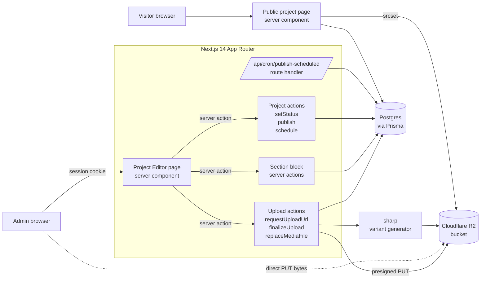
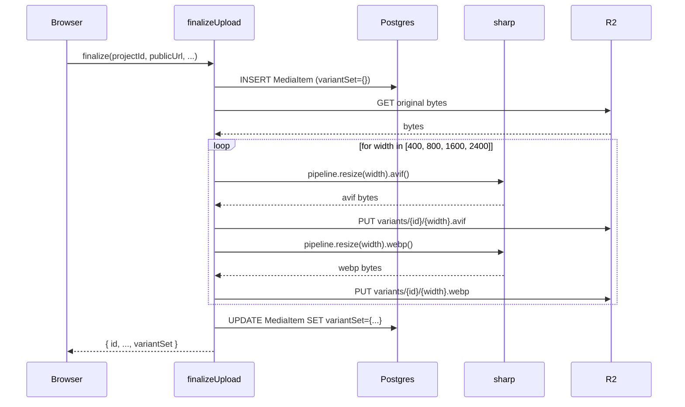

# Design Document

## Overview

This design extends the existing project editor at `app/admin/(protected)/projects/[id]/edit/` into an ArtStation-inspired authoring surface. The goal is to keep every change additive on top of the current Next.js 14 App Router + Prisma + Cloudflare R2 stack. We are not rebuilding the upload pipeline; we are layering five new capabilities on top of it:

1. **Section blocks** — a typed, ordered body that interleaves text, image, image_pair, video, and model3d blocks within a single Project, replacing the single `description` textarea as the primary case-study layout.
2. **Multi-format upload + 3D models** — formal first-class support for `glb`, `gltf`, and `usdz` (added to Allowed_Model_Mime), along with image variant generation and a stored `extension` column so the public renderer can pick the right viewer.
3. **In-place media replacement** — swap the file behind a Media_Item without losing alt text, caption, ordering, or section references.
4. **Responsive image variants** — server-side AVIF and WebP renditions at 400/800/1600/2400 px stored alongside the original; rendered as `<picture>` on the public site.
5. **Scheduled publishing** — a third Project_Status value (`scheduled`) plus a `scheduledAt` timestamp, promoted to `published` by a Vercel cron route.

The rest of the editor surface — basics form, taxonomy chips, drag-and-drop reorder, embed support, per-item metadata, publish-readiness checklist — is preserved in shape and extended where the requirements demand. The public detail page at `app/projects/[slug]/page.tsx` is updated in two specific places: the `<MediaBlock>` renderer learns to consume Variant_Sets and emit a `<picture>` element, and the 3D-model branch swaps its download-link placeholder for an interactive `<model-viewer>` web component.

This design treats the existing files listed below as binding fixtures. Their public exports are the integration boundary; new code plugs into them rather than replacing them.

| File | Role |
| --- | --- |
| `prisma/schema.prisma` | Source of truth for tables; new columns and the `SectionBlock` model are added here. |
| `app/admin/(protected)/projects/[id]/edit/upload-actions.ts` | Hosts `requestUploadUrl`, `finalizeUpload`, `addYouTubeEmbed`, `reorderMediaList`. New actions for `replaceMediaFile` and the variant pipeline live next to these. |
| `components/admin/ProjectMediaManager.tsx` | Client component for upload, embed, reorder, cover, delete. Gets a "Replace file" affordance and a small `Variant_Set` indicator per row. |
| `components/admin/ProjectEditorForm.tsx` | Basics + taxonomy + status. Status field is widened to a tri-state, gated by a `scheduledAt` datetime input. |
| `lib/admin/presign.ts` | R2 presign client. Allowed MIME list grows by one entry (`model/vnd.usdz+zip`). |
| `lib/validation/media.ts` | `ALLOWED_MODEL_MIME_TYPES` extended; otherwise unchanged. |
| `lib/auth/middleware.ts` | `requireAdmin()` continues to gate every server action. |

## Architecture

### High-level data flow



### Direct-to-R2 upload pipeline (preserved)

The two-step presign → finalize flow already in `upload-actions.ts` is preserved unchanged for new uploads:

1. Browser calls `requestUploadUrl(projectId, filename, contentType, contentLength)`. The action issues a presigned PUT URL **only** when both `contentType` is in `ALLOWED_IMAGE_MIME_TYPES ∪ ALLOWED_VIDEO_MIME_TYPES ∪ ALLOWED_MODEL_MIME_TYPES` and `contentLength` is a finite positive integer in `(0, MAX_MEDIA_BYTES]` (Requirement 2.1, 2.5, 2.6). MIME / size rejections short-circuit before the R2 client is touched and never produce a URL.
2. Browser PUTs the bytes directly to the presigned URL (XHR with progress). The presigned URL is issued with a 600-second TTL. If the PUT does not return a 2xx within that window — whether the failure is a non-2xx response, an aborted socket, or the client wall-clock exceeding 600 s — the browser surfaces `upload_failed` and the queue does **not** call `finalizeUpload` for that file (Requirement 2.8). No Media_Item row is created; the abandoned object in R2 is reaped by the bucket's lifecycle rule for unfinalized uploads (the same rule already used for cancelled uploads).
3. Browser calls `finalizeUpload(projectId, publicUrl, contentType, contentLength, filename)`.
4. `finalizeUpload` writes the `MediaItem` row, probes intrinsic dimensions for images via sharp, and — new in this design — kicks off the variant pipeline for image-kind uploads. For image kinds the dimension probe is a strict gate: the row is **not** marked visible to the Media_Manager listing until sharp returns a positive integer width and height (Requirement 2.9). If sharp throws or returns non-positive dimensions, `finalizeUpload` deletes the just-uploaded object from R2, returns `{ ok: false, code: 'invalid_format' }`, and never creates the Media_Item row (Requirement 2.10). For every kind (image, video, model3d) the lowercase file extension derived from the validated MIME via `MIME_TO_EXT` is persisted on `MediaItem.extension`; for model3d uploads the persisted value is exactly one of `glb`, `gltf`, or `usdz` (Requirement 2.11).

### Variant generation pipeline

The variant pipeline runs **inline** inside `finalizeUpload` for image uploads. Inline is preferred over a deferred queue because:

- Vercel server actions can run for up to 60 seconds on the Pro plan; sharp can generate 4 widths × 2 formats from a typical portrait JPEG in well under that window.
- The R2 round-trip is the dominant cost. Inline keeps it on the same network path the original upload already used.
- The user's browser is already showing a "processing" state after PUT completes; inline lets us flip the row to "ready" in a single response.

For images larger than a configurable byte threshold (default 32 MB) sharp's `pipeline.toBuffer()` is replaced with `pipeline.toFile()` to a Node `tmpdir()` to avoid loading the entire decoded buffer into RAM. The pipeline still runs synchronously inside the server action.

When sharp throws on a single rendition (e.g., 2400 px width skipped because original is only 1800 px wide, or AVIF encoder fails on a corrupted color profile), the error is caught per rendition. Each individual rendition gets up to 3 attempts (the same retry budget Requirement 13 applies to client uploads); after the third failure the rendition is recorded with its truncated cause string and the loop continues to the next width / format pair. The `Variant_Set` column on `MediaItem` records both successful renditions and a per-rendition `VariantFailure` with `cause` truncated to at most 200 characters (Requirement 6.7), so the public renderer never has to query a partially-empty set.

When a Media_Item is deleted, `deleteVariantKeys(mediaId)` lists every `variants/{mediaId}/*` object in R2 and removes them inside the same transaction that deletes the `media_items` row, so no orphan renditions remain (Requirement 6.8). The cleanup helper is also invoked on the replacement path — see "In-place media replacement" below.

If `finalizeUpload` succeeds at writing the `MediaItem` row but the subsequent variant generation throws before any rendition is persisted, the row remains with `variantSet = { renditions: [], failures: [...] }`. The `Public_Renderer` already falls back to the original `storageKey` for empty `renditions` (Requirement 6.6), so the user-visible failure mode is "no responsive variants yet" rather than "broken row".



### Scheduled publish worker

Vercel hosts a cron-triggered route at `/api/cron/publish-scheduled` that runs every minute (Pro plan) or every five minutes (Hobby plan). The route:

1. Calls `requireCronAuth()` against the `Authorization: Bearer <CRON_SECRET>` header that Vercel injects into cron invocations. If the header is missing, malformed, or the bearer token does not match `process.env.CRON_SECRET` exactly (constant-time comparison), the route responds with HTTP 401 and never reads or mutates any `projects` row (Requirement 7.11).
2. Runs a single transactional update that promotes every due Project in one round trip:
   ```sql
   UPDATE projects
      SET status = 'published',
          published_at = COALESCE(published_at, NOW()),
          scheduled_at = NULL
    WHERE status = 'scheduled' AND scheduled_at <= NOW()
   RETURNING id, slug;
   ```
   Because the SQL applies the transition to every due row in the same statement, a single invocation processes all due Projects together (Requirement 7.8). The route then iterates the returned `(id, slug)` pairs to revalidate paths; if revalidation throws for one slug the route logs the error and continues with the remaining slugs so a single bad slug does not block the rest (Requirement 7.8 "continue processing").
3. Awaits `revalidatePath('/projects/' + slug)`, `revalidatePath('/gallery')`, and `revalidatePath('/')` for every promoted project before returning a response, so any request received after the invocation completes returns the newly published Project (Requirement 7.12). `/gallery` and `/` are revalidated once at the end of the loop rather than once per slug since they are project-list surfaces.

The cron route never reads cookies, never honours user input, and is idempotent: re-invoking it with no scheduled work is a single no-op SQL statement.

The `saveProject` action enforces the upper bound on `scheduledAt` (`> now AND <= now + 365 days`) via `parseScheduledAt` in `lib/validation/schedule.ts` (Requirement 7.2). Any timestamp at or before `now` rejects with `scheduled_at_in_past`; any timestamp more than 365 days in the future rejects with the same `scheduled_at_in_past` code (the same field-level error message communicates both bounds since the user remediation is identical: "pick a closer date").

The Admin can also trigger an immediate publish or unpublish through `publishProject` and `unpublishProject` server actions that share the same `validatePublishable()` gate; the cron path is purely a clock-driven shortcut for the scheduled case.

### Publish-readiness aggregation

`validatePublishable(project)` in `lib/validation/project.ts` evaluates every rule in Requirement 8 and returns the **distinct union** of failing error codes in a deterministic, stable order:

```typescript
const RULE_ORDER: ReadonlyArray<PublishReadinessCode> = [
  'missing_title',
  'invalid_slug',
  'missing_category',
  'missing_cover',
  'no_media',
  'missing_alt_text',
  'block_reference_broken',
];
```

The validator does **not** short-circuit: every rule is evaluated against the candidate Project, the failures are collected, and the result envelope is `{ ok: false, missing: ReadonlyArray<PublishReadinessCode> }` where `missing` is filtered against `RULE_ORDER` so duplicate detections collapse to a single code per rule and the output order is stable across calls (Requirement 8.9). The Admin sees every blocker at once rather than fixing them one at a time.

When `validatePublishable` returns `{ ok: false }`, the calling action — `saveProject`, `publishProject`, or `scheduleProject` — leaves the persisted Project state exactly as it was; the transition is rejected before any column write (Requirement 8.1, "evaluate the Publish_Readiness_Checklist before persisting the transition"). The validator is a pure function over the project snapshot it is handed, so running it twice on the same input always produces the same envelope (idempotence).

### Server action surface (additions)

```typescript
// upload-actions.ts (additions)
replaceMediaFile(
  mediaId: string,
  publicUrl: string,
  contentType: string,
  contentLength: number,
  filename: string,
): Promise<ReplaceMediaResult>

// section-actions.ts (new file)
addSectionBlock(projectId: string, kind: SectionBlockKind): Promise<SectionBlockResult>
updateSectionBlock(blockId: string, patch: SectionBlockPatch): Promise<SectionBlockResult>
removeSectionBlock(blockId: string): Promise<SectionBlockResult>
reorderSectionBlocks(projectId: string, orderedIds: ReadonlyArray<string>): Promise<ReorderResult>

// edit/actions.ts (additions)
scheduleProject(projectId: string, scheduledAt: string): Promise<ProjectActionResult>
unpublishProject(projectId: string): Promise<ProjectActionResult>
```

All new actions call `requireAdmin()` first, validate inputs, run inside a single Prisma transaction where multi-row writes are involved, and call `revalidatePath()` for the affected admin and public surfaces.

### Media reorder pipeline

`reorderMediaList(projectId, orderedIds)` is the existing server action; this design hardens its envelope and timing without changing the two-pass renumber.

- **Client submission window.** When the Admin drops a row, `ProjectMediaManager` debounces the persisted submission to 500 ms after the last drop and then dispatches the new ordered id list. Within that window the local list state is the source of truth so consecutive drops collapse into a single network round trip (Requirement 3.1, "within one user gesture").
- **Optimistic ordering.** The component immediately reorders its local `items` array so the Admin sees no flicker. The same holds for `ProjectSectionEditor` after `reorderSectionBlocks`. While the request is in flight, the row is rendered in its optimistic position with no spinner (Requirement 3.6).
- **Request timeout.** The fetch is wrapped in `AbortController` with a 10-second timeout. On timeout the component reverts the local order to the pre-drop snapshot and surfaces the error against the row (Requirement 3.7).
- **Server-side rejection codes.** `reorderMediaList` returns `{ ok: false, code: 'unknown_media_id' }` when any supplied id does not belong to the target Project (Requirement 3.3), `{ ok: false, code: 'reorder_count_mismatch' }` when the count of supplied ids differs from `prisma.mediaItem.count({ where: { projectId } })` (Requirement 3.4), and additionally `{ ok: false, code: 'reorder_duplicate_id' }` when the supplied list contains a duplicate id. All rejections happen before any row is mutated; the transaction wraps the count check and the two-pass renumber.

The same shape is applied to `reorderSectionBlocks` for Section_Blocks: both use the same envelope, the same 500 ms / 10 s timing, and the same duplicate-id rejection.

### In-place media replacement

`replaceMediaFile(mediaId, publicUrl, contentType, contentLength, filename)` runs as a single server action invoked from the per-row "Replace file" affordance in `ProjectMediaManager`. The flow is:

1. `requireAdmin()`.
2. Load the existing `MediaItem` by id (and abort with `unknown_media_id` if missing).
3. Compare `inferKindFromMime(contentType)` to the existing `MediaItem.kind`. If they differ, return `{ ok: false, code: 'kind_change_disallowed' }` immediately and **do not** mutate the row, **do not** invalidate variants, **do not** delete any object from R2 (Requirement 4.3).
4. In a single Prisma transaction, update `storageKey`, `contentHash`, `mimeType`, `byteSize`, `width`, `height`, `extension` while preserving `id`, `projectId`, `altText`, `caption`, `ordering`. Section_Block references continue to point at `MediaItem.id` and remain valid (Requirement 4.6).
5. Always invalidate the prior `Variant_Set` by writing `variantSet = { renditions: [], failures: [] }` and calling `deleteVariantKeys(mediaId)` for every kind, so leftover renditions never serve stale bytes (Requirement 4.4).
6. Regenerate variants **only when** the new `kind` is `image` (Requirement 4.5/4.7). Video and model3d replacements skip the sharp pipeline entirely.
7. Call `revalidateProjectPaths(slug)` so the next public request to `/projects/{slug}` returns the new file (Requirement 4.6 — observable as the next public response carrying the new `storageKey`).

**Upload-failure rollback.** If the browser's PUT to the new presigned URL fails or times out (the same 600-second / non-2xx envelope used for fresh uploads), the client never invokes `replaceMediaFile` and the existing `MediaItem` row remains exactly as it was. If `replaceMediaFile` is invoked but the variant regeneration step throws, the transaction has already committed the new `storageKey` and friends — but step 5 ran first, so `variantSet` is empty and the public renderer falls back to the original `storageKey` rendering (Requirement 6.6). On any thrown error after step 4, the action returns `{ ok: false, code: 'upload_failed' }` and the orphan object at the **previous** `storageKey` is queued for cleanup by the bucket lifecycle rule.

### Cover selection lifecycle

`setCoverMedia(projectId, mediaItemId)` is the canonical entry point. It enforces:

- `cover_must_be_image` when the targeted Media_Item's `kind` is not `image` (Requirement 5.2).
- `cover_not_in_project` when the targeted Media_Item's `projectId` does not match the supplied `projectId` (Requirement 5.3).
- `cover_media_not_found` when the Media_Item id does not resolve to an existing row.

When validation rejects, `Project.coverMediaId` is left exactly as it was, including for the `cover_media_not_found` path; no mutation occurs on any rejection branch (Requirement 5.2, 5.3 amendments — "rejection paths preserve coverMediaId").

**Auto-set on first image upload.** When `finalizeUpload` finalises a new image-kind Media_Item and the parent Project has `coverMediaId IS NULL`, the action calls `setCoverMediaSilent` (a server-internal variant of `setCoverMedia` that bypasses the user-facing rejection codes) inside the same transaction (Requirement 5.4). The "first upload" check is positional: it triggers when this is the first **image** Media_Item to land on the Project, regardless of whether earlier uploads of other kinds succeeded. If the Project already has a cover, the auto-set is a no-op.

**Auto-clear on cover delete.** The Prisma relation between `Project.coverMediaId` and `MediaItem.id` uses `onDelete: SetNull` so deleting a Media_Item that is currently the cover automatically nulls `Project.coverMediaId` (Requirement 5.5). `deleteMediaItem` then revalidates `/gallery` and `/projects/{slug}` so the gallery thumbnail disappears within the same request.

**Save persistence latency.** The set-cover server action is awaited before the editor surfaces "saved" feedback to the Admin; on a healthy path the action completes in well under 2 seconds (database round trip + revalidation only). The 2-second budget is documented for the user-visible feedback ceiling and is not enforced server-side; if the database is degraded the action still returns successfully and the editor surfaces the slow response naturally.

### Embed URL parser

`lib/admin/embeds.ts::parseEmbedUrl(url)` is the gatekeeper for embed creation. It returns `{ provider, embedUrl, thumbnailUrl }` only when **all** of the following hold:

- `url` is non-empty after trimming and at most 2048 characters (Requirement 9.1; rejected as `unsupported_embed_provider` for any longer string).
- `url` parses as a valid `URL` and its scheme is exactly `https:` (Requirement 9.1; non-HTTPS rejects).
- The URL's hostname matches a member of the allowlist `['youtube.com', 'www.youtube.com', 'youtu.be', 'vimeo.com', 'www.vimeo.com', 'player.vimeo.com']` after normalisation. No other provider is accepted (Requirement 9.1, 9.2).
- The provider's id-extraction regex matches (e.g., a YouTube `v=` query param or `youtu.be/<id>` path; a Vimeo `/<numeric-id>` path).

Every other input returns `null`, and `addYouTubeEmbed` (the existing exported action) translates the `null` into `{ ok: false, code: 'unsupported_embed_provider' }` (Requirement 9.2).

When the parser succeeds, the caller persists:
- `kind = video`, `embedUrl = parsed.embedUrl` (always HTTPS).
- `byteSize = 0` always, since the row is non-stored (Requirement 9.3, 9.4).
- `storageKey = parsed.thumbnailUrl` when the provider exposes one (e.g., YouTube's `i.ytimg.com` thumbnail), `storageKey = null` otherwise (Requirement 9.4).

### Metadata normalisation

`normalizeAltText(input)` and `normalizeCaption(input)` in `lib/validation/media.ts` implement the trimming rules. Both helpers:

1. Strip leading and trailing characters belonging to the Unicode whitespace categories `space` (U+0020), `tab` (U+0009), `CR` (U+000D), and `LF` (U+000A). Non-ASCII whitespace (`\u00A0`, `\u2028`, etc.) is left intact so authors can use them deliberately inside captions.
2. Return `null` when the trimmed result is the empty string (Requirement 10.4).
3. Clamp to 500 / 200 characters respectively (Requirement 10.1, 10.2).

The same normalisation runs server-side in `updateMediaItem` and on the client immediately before `setSavingState('saving')`, so the displayed value matches what was persisted. The editor surfaces "Saved" feedback within 2 seconds of the user pressing Save on a healthy path; the latency budget covers the Prisma round trip plus the `revalidatePath` calls.

### Cache revalidation

Every Project create, update, or delete operation in `app/admin/(protected)/projects/**` calls the shared `revalidateProjectPaths(slug)` helper, which awaits in order:

1. `revalidatePath('/admin/projects')` (Requirement 14.1).
2. `revalidatePath('/gallery')` (Requirement 14.2).
3. `revalidatePath('/')` (so the home-page featured grid picks up the change).
4. `revalidatePath('/projects/' + slug)` when `slug` is non-empty (Requirement 14.3).

When the slug changes during an update, the action calls `revalidateProjectPaths(oldSlug)` and `revalidateProjectPaths(newSlug)` so both URLs are refreshed (Requirement 14.4).

The same helper is invoked by `addSectionBlock`, `updateSectionBlock`, `removeSectionBlock`, `reorderSectionBlocks`, `setCoverMedia`, `deleteMediaItem`, `replaceMediaFile`, `addYouTubeEmbed`, and the cron route, so any mutation that affects the public surface flushes the right caches.

**Failure handling.** Each `revalidatePath` call is wrapped in a try/catch. A failure in any individual path is logged with the path and reason, accumulated into a `revalidationWarnings: ReadonlyArray<string>` field on the action's result envelope, and surfaced to the Admin as a non-blocking warning banner. The persisted mutation itself is **not** rolled back — the database state is the canonical source of truth, and a failed revalidation only delays the public surface from picking up the change until the next ISR window (Requirement 14.5).

### Public rendering of Section_Blocks

`app/projects/[slug]/page.tsx` fetches the Project's `sectionBlocks` ordered by `(ordering ASC, createdAt ASC)` so deterministic rendering survives the rare tie when two blocks share the same `ordering` value mid-reorder. The render loop is:

```typescript
for (const block of sectionBlocks) {
  const node = renderSectionBlock(block, mediaIndex);
  if (node === null) continue; // skip-on-missing — see below
  yield node;
}
```

`renderSectionBlock` is a switch over `block.kind`:

- **`text`.** Renders sanitised HTML inside a prose container. If the trimmed `body` is empty, returns `null` so the block is skipped without an error (Requirement 16.4). Maximum render length is 20 000 characters (the editor enforces 10 000; legacy seeded blocks may carry longer descriptions).
- **`image`.** Renders `<ResponsiveImage>` with the referenced Media_Item's `variantSet`. Returns `null` if the referenced row is missing or has no `storageKey` (Requirement 16.12).
- **`image_pair`.** Renders a CSS grid that is two columns at viewport widths `>= 768px` and a single stacked column below 768 px (Requirement 16.6). The breakpoint is implemented with `@media (min-width: 768px)`. **Partial availability:** if exactly one of the two referenced Media_Items is missing or has no `storageKey`, the grid degrades to a single-column rendering of the surviving image and the missing slot is omitted, with no visitor-facing error (Requirement 16.7). If both are missing, the block returns `null` (Requirement 16.12).
- **`video`.** Reuses the same HTML5 `<video>` / iframe rule the existing renderer applies for video Media_Items (Requirement 16.8 / 9.5). Returns `null` if the referenced row is missing.
- **`model3d`.** Looks up `mediaItem.extension`, **lower-cases** it, and switches:
  - `glb` or `gltf` → `<model-viewer src={storageKey} ar camera-controls auto-rotate>` (Requirement 16.9).
  - `usdz` → renders an Apple AR Quick Look anchor `<a rel="ar" href={storageKey}></a>` so iOS Safari surfaces the AR badge (Requirement 16.10). When no poster is available the anchor wraps a plain text label.
  - any other extension → `null` (Requirement 16.11).
  Extension matching is case-insensitive throughout: `extension?.toLowerCase()` is the only comparison key, so legacy rows whose extension was persisted in mixed case still render correctly.

The `<model-viewer>` web component's `<script type="module">` tag is included on the page **only when at least one model3d Section_Block resolves to a renderable Media_Item** so visitors do not pay the script cost on text-only case studies. The script src is added to the page-level CSP allowlist (`script-src` and `connect-src` for the unpkg origin) and the comment in the page documents that requirement.

When `sectionBlocks.length === 0` the page falls back to rendering the legacy `Project.description` field (Requirement 16.2), preserving compatibility with projects that have not yet been migrated through the Section_Editor.

### Migration strategy

The migration is split into a single SQL migration file plus a runtime-only behavior:

- **SQL migration** (`prisma migrate`):
  - Add `scheduled` value to the `ProjectStatus` enum.
  - Add `Project.scheduledAt: timestamp NULL`.
  - Add `MediaItem.extension: varchar(16) NULL`.
  - Add `MediaItem.variantSet: jsonb NOT NULL DEFAULT '{}'::jsonb`.
  - Backfill `MediaItem.extension` from `mimeType` for existing rows.
  - Backfill `Project.publishedAt = updatedAt WHERE status = 'published' AND publishedAt IS NULL`.
  - Create the `section_blocks` table.
  - Extend the `MediaItem.mimeType` allow-list at the application layer (no SQL change; the column is a free-text varchar).
- **Runtime-only behavior**:
  - On first open of the editor for a project that has a non-empty `description` and zero rows in `section_blocks`, the Section_Editor renders a virtual seed block of kind `text` with `body = description`. The seed is **not** persisted until the Admin saves the Section_Editor for the first time, at which point the seed plus any added blocks are written and `Project.description` is left untouched (kept for forward compatibility but no longer rendered on the public detail page once any `SectionBlock` exists).

## Components and Interfaces

### Admin client components

| Component | File | Responsibility |
| --- | --- | --- |
| `ProjectEditorForm` | `components/admin/ProjectEditorForm.tsx` | Existing component. Status control widens to `draft` / `scheduled` / `published` with a `<input type="datetime-local">` revealed when `scheduled` is selected. Submits via the existing bound `saveProject` action; the action grows a `scheduledAt` field. |
| `ProjectMediaManager` | `components/admin/ProjectMediaManager.tsx` | Existing component. Each `SortableMediaRow` gains a "Replace file" button that re-uses the same `<input type="file">` flow but routes through `replaceMediaFile` instead of `finalizeUpload`. Variant_Set status is shown as a small "✓ 2 variants" badge per image row. |
| `ProjectSectionEditor` | `components/admin/ProjectSectionEditor.tsx` (new) | Renders the ordered list of Section_Blocks beneath the Media manager. Drag-and-drop powered by the same `@dnd-kit` setup as media reorder. Each block exposes an inline editor specific to its kind: a textarea for `text`, a media-picker dropdown for `image` / `image_pair` / `video` / `model3d`. |
| `ProjectScheduleControl` | inline within `ProjectEditorForm` | Three radio chips (Draft, Scheduled, Published) plus the conditional `scheduledAt` input. The chip group writes a hidden `status` field; the datetime input writes a hidden `scheduledAt` field as ISO. |

### Server-side modules

| Module | File | Responsibility |
| --- | --- | --- |
| `lib/admin/variants.ts` (new) | sharp-driven Variant_Set generator. Pure-ish: takes a `Buffer` plus a `MediaItemId` and returns a `VariantSet` object. R2 PUTs are delegated to a passed-in callback so unit tests can mock storage. |
| `lib/admin/sectionBlocks.ts` (new) | Pure validators and reducers for Section_Block CRUD: `validateAddBlock`, `validateUpdateBlock`, `renumberBlocks`. No I/O; consumed by the server actions. |
| `lib/validation/schedule.ts` (new) | Pure parser/validator: `parseScheduledAt(input: string, now: Date): Result<Date, ScheduleError>`. Reused by the `saveProject`, `scheduleProject`, and cron paths. |
| `lib/validation/media.ts` | Existing. `ALLOWED_MODEL_MIME_TYPES` extended to include `model/vnd.usdz+zip`. `MAX_MEDIA_BYTES` unchanged. |
| `lib/admin/presign.ts` | Existing. Picks up the new MIME automatically through `ALLOWED_MIME_TYPES_BY_KIND`. |
| `app/admin/(protected)/projects/[id]/edit/section-actions.ts` (new) | Server actions for Section_Block CRUD and reorder. |
| `app/api/cron/publish-scheduled/route.ts` (new) | Vercel cron handler. |

### Public renderer surface

| Component | File | Responsibility |
| --- | --- | --- |
| `ResponsiveImage` | `components/media/ResponsiveImage.tsx` | Existing component. Updated to accept an optional `variantSet` prop and emit `<picture>` with `<source type="image/avif">` and `<source type="image/webp">` plus the original `` fallback when present; otherwise falls back to its current single-source rendering. |
| `MediaBlock` | inline in `app/projects/[slug]/page.tsx` | Existing function. Updated to render Section_Blocks (when present) instead of falling through to the bare `mediaItems` list. The 3D-model branch is replaced with `<model-viewer>` for `glb` / `gltf` and a download-link fallback for `usdz` outside Safari. |
| `SectionBlockRenderer` (new, inline) | `app/projects/[slug]/page.tsx` | Switch over `SectionBlock.kind`: `text` → prose, `image` → single `ResponsiveImage`, `image_pair` → 2-column grid of `ResponsiveImage`, `video` → existing video block (HTML5 or iframe), `model3d` → `<model-viewer>` or `<a>` fallback. |

### Action result envelopes

All new server actions return the discriminated-union envelope shape already used by `upload-actions.ts`:

```typescript
type Result<T> =
  | { readonly ok: true; readonly value: T }
  | { readonly ok: false; readonly error: string; readonly code: string };
```

The `code` field is the stable machine-readable error code listed against each acceptance criterion (e.g. `block_media_mismatch`, `cover_must_be_image`, `scheduled_at_in_past`). The free-text `error` is used by the client to render the human-readable message.

## Data Models

### New: `SectionBlock`

```prisma
enum SectionBlockKind {
  text
  image
  image_pair
  video
  model3d
}

model SectionBlock {
  id            String           @id @default(uuid()) @db.Uuid
  projectId     String           @db.Uuid
  project       Project          @relation(fields: [projectId], references: [id], onDelete: Cascade)
  kind          SectionBlockKind
  ordering      Int

  // text block payload
  body          String?          @db.Text

  // image / video / model3d block payload (single Media reference)
  mediaItemId   String?          @db.Uuid
  mediaItem     MediaItem?       @relation("SectionBlockPrimary", fields: [mediaItemId], references: [id], onDelete: SetNull, onUpdate: Cascade)

  // image_pair block payload (second Media reference)
  mediaItemBId  String?          @db.Uuid
  mediaItemB    MediaItem?       @relation("SectionBlockSecondary", fields: [mediaItemBId], references: [id], onDelete: SetNull, onUpdate: Cascade)

  createdAt     DateTime         @default(now())
  updatedAt     DateTime         @updatedAt

  @@index([projectId, ordering])
  @@map("section_blocks")
}
```

Notes:

- `body` is non-null exactly when `kind = text`. The application layer enforces this; the column is nullable so the row can carry a media reference instead.
- `mediaItemId` is non-null for `image`, `video`, and `model3d` blocks and for `image_pair`'s first slot. `mediaItemBId` is non-null only for `image_pair`. Both columns are `SetNull` on delete so a Media_Item delete leaves the section visible (with a "media missing" placeholder) rather than cascading and silently deleting the block.
- `(projectId, ordering)` is indexed for the order-by query that drives the editor and the public renderer. Application logic enforces that orderings form a contiguous integer sequence starting at 0 per project; the database does not enforce this directly.

### Modified: `Project`

```prisma
enum ProjectStatus {
  draft
  scheduled  // new
  published
}

model Project {
  // ... existing columns ...
  status        ProjectStatus @default(draft)
  publishedAt   DateTime?
  scheduledAt   DateTime?     // new
  // ... existing columns ...

  sectionBlocks SectionBlock[] // new reverse relation

  @@index([status])
  @@index([publishedAt(sort: Desc)])
  @@index([status, scheduledAt])  // new — supports the cron poll
  @@map("projects")
}
```

The `scheduledAt` column is non-null exactly when `status = scheduled`. Both `saveProject` and `scheduleProject` enforce this invariant.

### Modified: `MediaItem`

```prisma
model MediaItem {
  // ... existing columns ...
  extension String?  @db.VarChar(16)         // new — `glb` | `gltf` | `usdz` | `jpg` | ...
  variantSet Json    @default("{}") @db.JsonB // new — Variant_Set payload
  // ... existing columns ...

  sectionBlocksPrimary   SectionBlock[] @relation("SectionBlockPrimary")
  sectionBlocksSecondary SectionBlock[] @relation("SectionBlockSecondary")
}
```

The `variantSet` column is shaped as:

```typescript
interface VariantSet {
  readonly renditions: ReadonlyArray<Variant>;
  readonly failures: ReadonlyArray<VariantFailure>;
}

interface Variant {
  readonly format: 'avif' | 'webp';
  readonly width: number;
  readonly height: number;
  readonly storageKey: string;  // public URL of the rendition
  readonly byteSize: number;
}

interface VariantFailure {
  readonly format: 'avif' | 'webp';
  readonly width: number;
  readonly cause: string;       // sharp error message, truncated to 200 chars
}
```

`renditions` is empty for `video`, `model3d`, and embed rows; the public renderer treats an empty `renditions` array as the legacy fallback path.

### Section_Block payload validation rules

Encoded in `lib/admin/sectionBlocks.ts` and applied by the server actions before persistence:

| Kind | Required | Forbidden |
| --- | --- | --- |
| `text` | `body` length 1..10000 characters after trimming and HTML sanitisation; rejected as `invalid_text_body` otherwise | `mediaItemId`, `mediaItemBId` |
| `image` | `mediaItemId` references an `image`-kind Media_Item on the same Project | `body`, `mediaItemBId` |
| `image_pair` | `mediaItemId` and `mediaItemBId` both reference `image`-kind Media_Items on the same Project; ids are distinct (else `block_image_pair_duplicate_media`) | `body` |
| `video` | `mediaItemId` references a `video`-kind Media_Item on the same Project | `body`, `mediaItemBId` |
| `model3d` | `mediaItemId` references a `model3d`-kind Media_Item on the same Project | `body`, `mediaItemBId` |

If the kind is `image`, `image_pair`, `video`, or `model3d` and the corresponding `mediaItemId` (or both, for `image_pair`) is null/empty, the validator rejects with `block_media_required` before any reference lookup runs (Requirement 1.18). Reference-mismatch (`block_media_mismatch`) and kind-mismatch (`block_kind_mismatch`) are only emitted when an id is supplied but resolves to the wrong project or a row of the wrong kind.

**Block count cap.** `addSectionBlock` checks `prisma.sectionBlock.count({ where: { projectId } })` inside the same transaction that inserts the new row. If the existing count is already `>= 200`, the action rejects with `block_limit_exceeded` and never inserts the row (Requirement 1.19).

**Text body sanitisation.** The `text` kind accepts a sanitised HTML subset (paragraphs, line breaks, lists, inline emphasis, links). Sanitisation runs on the **server** inside `validateAddBlock` / `validateUpdateBlock` using `sanitize-html` (Node-side; chosen over `DOMPurify` because the server actions execute in the Node.js runtime, not the browser). The sanitiser is the only trust boundary: even if the client renders a rich-text editor, the server re-sanitises the body string before persisting to `SectionBlock.body`. Allowed tags: `p`, `br`, `strong`, `em`, `ul`, `ol`, `li`, `a`. Allowed attributes: `href` on `a` (HTTPS only). Trimming applies after sanitisation; an empty result rejects with `invalid_text_body` (Requirement 1.4, 1.14).

**Reorder.** Reorder operations renumber the surviving blocks to a contiguous sequence starting at 0 in a single transactional pass identical to the existing `reorderMediaList` two-pass strategy. Before the pass runs, `reorderSectionBlocks` validates that (a) every supplied id belongs to the target Project — otherwise `unknown_block_id` (Requirement 1.16), and (b) the count of supplied ids equals the count of existing Section_Blocks for the Project — otherwise `reorder_count_mismatch` (Requirement 1.17). Both rejections happen before any row is mutated.

### Allowed_Model_Mime extension

`lib/validation/media.ts` adds one entry:

```typescript
export const ALLOWED_MODEL_MIME_TYPES: ReadonlyArray<ModelMimeType> = [
  'model/gltf+json',
  'model/gltf-binary',
  'model/vnd.usdz+zip',  // new
];
```

The corresponding TypeScript union (`ModelMimeType` in `lib/types/domain.ts`) is widened by the same entry. The `MIME_TO_EXT` map in `lib/admin/uploads.ts` adds `'model/vnd.usdz+zip': 'usdz'`.

### Variant_Set storage layout

For an image Media_Item with `id = abc123` whose original lives at `media/<projectId>/<nonce>-<filename>.jpg`, variants are stored at:

```
variants/abc123/400.avif
variants/abc123/400.webp
variants/abc123/800.avif
variants/abc123/800.webp
variants/abc123/1600.avif
variants/abc123/1600.webp
variants/abc123/2400.avif
variants/abc123/2400.webp
```

The flat `variants/<id>/<width>.<ext>` layout is chosen so that replacing a Media_Item file (Requirement 4) lets the variant pipeline regenerate the same set of keys, overwriting any prior renditions atomically per key without leaving orphans.

### Migration order

Generated by `prisma migrate dev --name artstation_upload`:

1. `ALTER TYPE "ProjectStatus" ADD VALUE 'scheduled' BEFORE 'published'` (Postgres requires enum additions outside transactions; Prisma handles this).
2. `ALTER TABLE projects ADD COLUMN scheduled_at TIMESTAMP NULL`.
3. `ALTER TABLE media_items ADD COLUMN extension VARCHAR(16) NULL`.
4. `ALTER TABLE media_items ADD COLUMN variant_set JSONB NOT NULL DEFAULT '{}'::jsonb`.
5. Backfill: `UPDATE media_items SET extension = CASE mime_type WHEN 'image/jpeg' THEN 'jpg' WHEN 'image/png' THEN 'png' WHEN 'image/webp' THEN 'webp' WHEN 'video/mp4' THEN 'mp4' WHEN 'video/webm' THEN 'webm' WHEN 'model/gltf+json' THEN 'gltf' WHEN 'model/gltf-binary' THEN 'glb' ELSE NULL END`.
6. Backfill: `UPDATE projects SET published_at = COALESCE(updated_at, created_at) WHERE status = 'published' AND published_at IS NULL` — `updated_at` is the primary fallback, `created_at` is used when `updated_at` is null on legacy rows (Requirement 15.2).
7. `CREATE TABLE section_blocks (...)` matching the Prisma model.
8. `CREATE INDEX section_blocks_project_id_ordering_idx ON section_blocks (project_id, ordering)`.
9. `CREATE INDEX projects_status_scheduled_at_idx ON projects (status, scheduled_at)`.

**Post-migration verification.** The migration is wrapped (everything except step 1, which Postgres requires outside a transaction) in a single `BEGIN ... COMMIT` block. Before `COMMIT`, the migration runs two assertions and aborts on either failure (Requirement 15.1):

- **Row-count equality.** `SELECT COUNT(*) FROM projects` and `SELECT COUNT(*) FROM media_items` must equal the pre-migration counts captured into temp tables on the first statement of the migration. Any divergence aborts the transaction.
- **Primary-key set equality.** `SELECT id FROM projects` and `SELECT id FROM media_items` must equal the pre-migration `id` sets (verified via `EXCEPT` on both sides). No row may be added, removed, or have its primary key rewritten by the schema migration itself.

If either assertion fails, the transaction rolls back; no partial schema changes survive. Operationally this means a failing migration leaves the production database exactly as it was, and the deploy is safe to re-attempt after fixing the root cause.

The `scheduledAt` column is left null for every existing Project (Requirement 15.3), which is the natural state after the additive `ADD COLUMN ... NULL` in step 2.

## Error Handling

The error surface is unified across server actions and the upload pipeline. Every action returns the discriminated `Result<T>` envelope; every error response carries a stable machine-readable `code` plus a human-readable `error` string the client renders against the offending field or row.

### Per-file upload retry budget

The `ProjectMediaManager` queue retains the existing `QueuedFile` state with the following hardened guarantees (Requirement 13):

- **Per-file retry budget.** Each queued file allows up to 3 retry attempts (the initial attempt plus 2 retries). After the third failure the file is marked `permanently_failed`, the "Retry" affordance is hidden, the final failure reason is retained next to the row, and no Media_Item row is created (Requirement 13.4, 13.5).
- **Cancel.** "Cancel" calls `xhr.abort()` on the in-flight `XMLHttpRequest` and removes the file from the queue. The component asserts that the abort completes within 1 second (the abort is synchronous so this budget is effectively a sanity check) and never invokes `finalizeUpload` for a cancelled file (Requirement 13.6).
- **Progress reporting.** While a file is in `uploading` status, the component subscribes to the XHR's `progress` event and additionally forces a `setState` tick every 500 ms (via `setInterval` cleared on completion) so the displayed integer percentage in `[0, 100]` updates at least every 500 ms even if the network goes quiet between progress events (Requirement 13.7).
- **Per-row error surfacing.** Errors returned by `finalizeUpload`, `replaceMediaFile`, or `addYouTubeEmbed` render against the originating row (or the embed input). Errors that cannot be attributed to a specific row render as a section-level banner at the top of the Media manager (Requirement 13.1, 13.2). Errors persist until the Admin modifies the related input or explicitly dismisses the message.

### Error code catalogue

The actions emit the codes already enumerated in the requirements document. The catalogue lives in `lib/admin/errors.ts` as a discriminated union so client components can render targeted remediations:

| Surface | Codes |
| --- | --- |
| Section_Block save | `block_media_required`, `block_media_mismatch`, `block_kind_mismatch`, `block_image_pair_duplicate_media`, `invalid_text_body`, `block_limit_exceeded` |
| Section_Block reorder | `unknown_block_id`, `reorder_count_mismatch`, `reorder_duplicate_id` |
| Media reorder | `unknown_media_id`, `reorder_count_mismatch`, `reorder_duplicate_id` |
| Upload pipeline | `invalid_format`, `file_too_large`, `upload_failed`, `kind_change_disallowed` |
| Cover | `cover_must_be_image`, `cover_not_in_project`, `cover_media_not_found` |
| Schedule | `scheduled_at_missing`, `scheduled_at_in_past` |
| Publish-readiness | `missing_title`, `invalid_slug`, `missing_category`, `missing_cover`, `no_media`, `missing_alt_text`, `block_reference_broken` |
| Embeds | `unsupported_embed_provider` |
| Auth | `unauthorized` |

## Testing Strategy

### Unit tests

Concrete examples and edge cases live next to the modules they exercise under `tests/unit/`:

- `tests/unit/variants.test.ts` — sharp pipeline partial-failure resilience, the 200-character cause truncation, the `deleteVariantKeys` cleanup helper.
- `tests/unit/cron-publish-scheduled.test.ts` — promotion query, idempotent no-op, `revalidatePath` calls per slug, HTTP 401 on missing/mismatched bearer.
- `tests/unit/scheduled-not-public.test.ts` — public-query filtering excludes `draft` and `scheduled` rows.
- `tests/unit/save-project-slug-rename.test.ts` — old + new slug revalidation on rename.
- `tests/unit/cover-media-cleanup.test.ts` — `Project.coverMediaId` flips to null on cover Media_Item delete.
- `tests/unit/responsive-image-variants.test.tsx` — `<picture>` fallback wiring with and without `variantSet`.
- `tests/unit/project-section-editor-seed.test.tsx` — virtual seed text block from legacy `description`, persistence on first save.
- `tests/unit/section-block-renderer-skip.test.tsx` — public renderer skips blocks with missing media and continues rendering subsequent blocks; partial `image_pair` degrades to a single-column rendering; case-insensitive extension matching for `glb` / `gltf` / `usdz`.
- `tests/unit/migration-postconditions.test.ts` — pre/post row counts and primary-key sets remain equal across the artstation_upload migration.

### Property-based tests

Property-based tests live under `tests/pbt/` using the already-installed `fast-check` library and run via `npm run test:pbt`. Each test is configured for at least 100 iterations and is tagged with the design property it validates.

PBT applies to this feature because every layered capability has clean input/output behaviour: the validators, reducers, and pure helpers (`parseScheduledAt`, `renumberBlocks`, `validateAddBlock`, `validatePublishable`, `normalizeAltText`, `normalizeSoftwareList`, `parseEmbedUrl`, `planVariantWidths`) are pure functions over their arguments, and the persistence layer is testable behind fake Prisma adapters. The IaC-style migration logic is tested with example-based assertions (row-count and PK equality) rather than property-based tests.

### Property reflection summary

Properties have been consolidated to avoid logically redundant tests. Notable consolidations:

- The "kick removes user" / "mute prevents messages" pattern from chat-room examples maps to a single Section_Block validation property that varies the `(blockKind, mediaKind)` cross product.
- Reorder permutation properties subsume the "ordering grows by one" property (which is implied by "every position 0..N-1 is occupied by exactly one supplied id").
- Replace-preservation and replace-rejection are co-tested with the same generator: the kind-mismatch branch is sampled by deliberately drawing a replacement kind that differs from the existing row's kind.

## Correctness Properties

*A property is a characteristic or behavior that should hold true across all valid executions of a system — essentially, a formal statement about what the system should do. Properties serve as the bridge between human-readable specifications and machine-verifiable correctness guarantees.*

The properties below are extracted from the `prework` analysis stored in context. Each property maps back to one or more acceptance criteria.

### Property 1: Media MIME and size validation

*For all* MIME strings `m` and integer sizes `s`, `requestUploadUrl` issues a presigned URL iff `m ∈ ALLOWED_IMAGE_MIME_TYPES ∪ ALLOWED_VIDEO_MIME_TYPES ∪ ALLOWED_MODEL_MIME_TYPES` AND `s ∈ (0, MAX_MEDIA_BYTES]`; rejections carry `invalid_format` for MIME failures and `file_too_large` for size failures.

**Validates: Requirements 2.1, 2.5, 2.6**

### Property 2: Schedule parser bounds and status transitions

*For all* timestamps `t` and clocks `now`, `parseScheduledAt(t.toISOString(), now)` returns `ok` iff `t > now AND t <= now + 365 days`. *For all* `(prevStatus, nextStatus)` pairs, the persisted triple satisfies `nextStatus === 'draft' ⇒ scheduledAt === null AND publishedAt === null`; `nextStatus === 'published' ⇒ scheduledAt === null AND (publishedAt unchanged when non-null else now)`; `nextStatus === 'scheduled' ⇒ scheduledAt > now AND scheduledAt <= now + 365 days`.

**Validates: Requirements 7.2, 7.3, 7.4, 7.5, 7.6**

### Property 3: Section_Block ordering reducers preserve contiguous sequences

*For all* lists of Section_Blocks `bs` with arbitrary integer orderings, `renumberBlocks(bs)` returns a permutation of the same ids whose `ordering` values are exactly `0..N-1` in input index order. *For all* `bs` and any new block `b`, `appendBlock(bs, b).at(-1).ordering === bs.length`. Removing any single block followed by `renumberBlocks` always yields a contiguous `0..N-2` sequence.

**Validates: Requirements 1.3, 1.9, 1.10**

### Property 4: Section_Block kind/media matching is total

*For all* `(blockKind, mediaKind, projectMatch)` tuples drawn from the cross product, `validateAddBlock` accepts iff `blockKind === 'text'` (no media required) OR `(blockKind === 'image' ∧ mediaKind === 'image' ∧ projectMatch)` OR `(blockKind === 'image_pair' ∧ both refs are image-kind ∧ projectMatch ∧ ids distinct)` OR `(blockKind === 'video' ∧ mediaKind === 'video' ∧ projectMatch)` OR `(blockKind === 'model3d' ∧ mediaKind === 'model3d' ∧ projectMatch)`. *For all* media-required block kinds saved without the required reference, the validator returns `block_media_required`. *For all* projects with 200 existing Section_Blocks, the validator rejects new adds with `block_limit_exceeded`.

**Validates: Requirements 1.5, 1.6, 1.7, 1.8, 1.11, 1.12, 1.18, 1.19**

### Property 5: Publish-readiness aggregates the distinct union of failures

*For all* synthesised Projects `p`, `validatePublishable(p).missing` equals the distinct union of `RULE_ORDER` codes whose precondition is violated, in `RULE_ORDER` index order. The validator is idempotent: `validatePublishable(p)` equals `validatePublishable(p)` for any pure snapshot `p`. On rejection, no column on `p` is mutated.

**Validates: Requirements 8.1, 8.9**

### Property 6: Software-list normaliser is idempotent and order-preserving

*For all* `xs: string[]`, when `normalizeSoftwareList(xs)` returns `ok`, `normalizeSoftwareList(value).value === value`. The output preserves the order and casing of each first-seen case-insensitive entry. Output length never exceeds input length and never exceeds 20.

**Validates: Requirements 11.3, 11.4, 11.5, 11.6**

### Property 7: Alt-text and caption normalisation

*For all* input strings `s`, `normalizeAltText(s)` returns `null` iff `s.trim().length === 0` after stripping the Unicode whitespace categories space / tab / CR / LF; otherwise it returns a string of length `<= 500` equal to the trimmed prefix. The function is idempotent under repeated application. The same property holds for `normalizeCaption` with bound 200.

**Validates: Requirements 10.1, 10.2, 10.3, 10.4**

### Property 8: Variant width planner never upscales and is monotone

*For all* `originalWidth >= 0`, `planVariantWidths(originalWidth)` returns a subset of `[400, 800, 1600, 2400]`, contains no width `w` such that `w > originalWidth * 1.1`, and is monotonically ordered ascending.

**Validates: Requirements 6.1, 6.2**

### Property 9: Media reorder respects the input permutation

*For all* lists of project media with id set `S` and any permutation `P` of `S`, after `reorderMediaList(projectId, P)` the database state satisfies `media[i].ordering === i AND media.find(m => m.ordering === i).id === P[i]`. *For all* lists `Q` with a foreign id, `reorderMediaList` returns `unknown_media_id` and leaves the state unchanged. *For all* lists whose length differs from `|S|`, returns `reorder_count_mismatch`. *For all* lists with a duplicate id, returns `reorder_duplicate_id`.

**Validates: Requirements 3.2, 3.3, 3.4, 3.5**

### Property 10: Replace preserves identity and rejects kind changes without mutation

*For all* pre-existing Media_Items `m` and replacement payloads `p` with the same kind, `replaceMediaFile(m.id, p)` returns a record where `id`, `projectId`, `altText`, `caption`, `ordering` equal `m`'s and `storageKey`, `contentHash`, `mimeType`, `byteSize`, `extension` equal `p`'s, and the prior `Variant_Set` is invalidated. *For all* `(m, p)` with differing kinds, the action returns `kind_change_disallowed` and the database row is byte-identical to `m`.

**Validates: Requirements 4.2, 4.3, 4.4**

### Property 11: Embed parser only accepts HTTPS YouTube and Vimeo URLs

*For all* URL strings `u`, `parseEmbedUrl(u)` returns non-null only when `u` is non-empty, at most 2048 characters, parses as a `URL`, has scheme `https:`, and has a hostname on the YouTube/Vimeo allowlist. The returned `embedUrl` always begins with `https://` and the returned provider is a member of the allowlist. Embed Media_Items always carry `byteSize === 0` and carry `storageKey === null` exactly when the resolved provider exposes no thumbnail.

**Validates: Requirements 9.1, 9.2, 9.3, 9.4**

### Property 12: Public renderer skips unrenderable blocks and continues

*For all* lists of Section_Blocks `bs` rendered against a Media_Item index `idx`, the renderer's output preserves the relative order of the renderable subset and omits every block whose primary Media_Item is missing or whose `model3d` extension (case-insensitive) is not in `{glb, gltf, usdz}`. *For all* `image_pair` blocks with exactly one missing slot, the output renders the surviving image as a single-column figure and never raises an error to the visitor.

**Validates: Requirements 16.1, 16.7, 16.9, 16.10, 16.11, 16.12**

